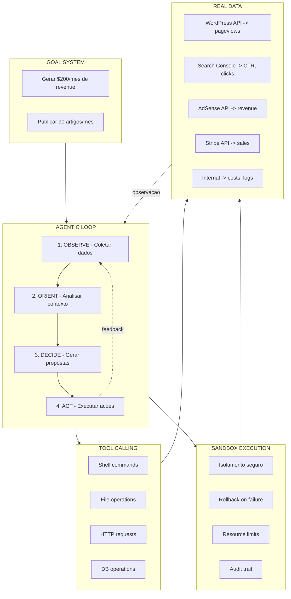

# Jarvis Autonomy Roadmap — De Assistente a Funcionario Autonomo

**Status**: Planejamento Ativo
**Ultima atualizacao**: 2026-02-13
**Visao**: Jarvis como agente autonomo capaz de gerar renda mensal

---

## 1. Visao Estrategica

O Jarvis esta evoluindo de um **assistente interativo de coding** para um **agente autonomo
que gera valor economico**. A meta final e que o Jarvis funcione como um "funcionario digital"
que:

1. **Executa** tarefas autonomamente (producao de conteudo, automacao)
2. **Observa** resultados e metricas de performance
3. **Analisa** dados e identifica oportunidades de melhoria
4. **Decide** acoes com base em metas definidas pelo usuario
5. **Atua** executando as decisoes (com ou sem aprovacao humana)
6. **Aprende** com os resultados para melhorar continuamente

### Modelo Mental: O Loop Autonomo

---

## 2. Diagnostico Atual — Gap Analysis

### Estado do Daemon (deploy)

O daemon está **implementado no código** (scheduler, pipelines, executor, goals, etc.), mas **não está em execução** no ambiente atual. A estrutura existe no repositório e pode ser compilada e configurada; o que impede o deploy em uso contínuo é a **limitação de créditos no OpenRouter** (ou outro provedor de LLM configurado), já que os pipelines do daemon consomem chamadas de API para geração de conteúdo e análise.

- **Em código**: Scheduler, PipelineRunner, pipelines (SEO, metrics, strategy_analyzer), ProposalExecutor, Goals, SQLite — tudo implementado.
- **Em execução**: Não; o daemon não está rodando de forma contínua por limite de créditos/API.
- **Alternativas**: Ver [Alternativas para rodar o daemon](./daemon-deploy-alternatives.md) (modelos locais, free tiers, outros provedores).

### O que JA funciona (codigo vs deploy)

| Camada | Componente | Status | Localizacao |
|--------|-----------|--------|-------------|
| Infraestrutura Daemon | Scheduler cron-like | Implementado (nao em deploy) | `daemon/src/scheduler.rs` |
| Infraestrutura Daemon | Pipeline runner + registry | Implementado (nao em deploy) | `daemon/src/runner.rs`, `pipeline.rs` |
| Infraestrutura Daemon | SQLite persistence (8 tabelas) | Implementado (nao em deploy) | `daemon-common/src/db.rs` |
| Pipeline SEO | Scraper RSS + Web | Implementado (nao em deploy) | `daemon/src/scraper/` |
| Pipeline SEO | LLM content generation | Implementado (nao em deploy) | `daemon/src/pipelines/seo_blog.rs` |
| Pipeline SEO | WordPress publisher | Implementado (nao em deploy) | `daemon/src/publisher/wordpress.rs` |
| Feedback Loop | Metrics collector | Implementado (nao em deploy) | `daemon/src/pipelines/metrics_collector.rs` |
| Feedback Loop | Strategy analyzer (LLM) | Implementado (nao em deploy) | `daemon/src/pipelines/strategy_analyzer.rs` |
| Feedback Loop | Proposals + approval workflow | Implementado (nao em deploy) | `daemon-common/`, `cli/src/daemon_cmd.rs` |
| TUI | Yolo mode (auto-approve) | Funcional | `tui/src/bottom_pane/approval_overlay.rs` |
| Core | Autonomous decision engine (skeleton) | Esqueleto | `core/src/autonomous/` |

### Gaps Criticos (O que FALTA)

| # | Gap | Impacto | Prioridade | Doc Referencia |
|---|-----|---------|------------|----------------|
| G1 | **Proposal Executor** — propostas aprovadas nao sao executadas | Loop quebrado: analisa mas nao atua | CRITICA | [proposal-executor.md](../features/proposal-executor.md) |
| G2 | **Goal System** — nao ha metas mensuraveis configuradas | Analyzer sem criterio de priorizacao | CRITICA | [goal-system.md](../features/goal-system.md) |
| G3 | **Real Data Integration** — metricas estimadas, nao reais | Decisoes baseadas em dados ficticios | CRITICA | [real-data-integration.md](../features/real-data-integration.md) |
| G4 | **Tool Calling Nativo** — depende do modelo suportar tools | TUI limitado a modelos caros | ALTA | [tool-calling-native.md](../features/tool-calling-native.md) |
| G5 | **Agentic Loop Completo** — TUI delega tudo ao modelo | Sem observacao/re-planning proprio | ALTA | [agentic-loop.md](../features/agentic-loop.md) |
| G6 | **Sandbox Execution Robusto** — sandbox basico, sem rollback | Risco em acoes autonomas destrutivas | ALTA | [sandbox-execution.md](../features/sandbox-execution.md) |

### Comparacao com Referencia (Claude Code / Cursor Agent)

| Capacidade | Claude Code / Cursor | Jarvis (atual) | Gap | Prioridade |
|------------|---------------------|----------------|-----|------------|
| Execucao de comandos | Sim, sandbox nativo | Sim, basico | G6 | ALTA |
| Tool calling | Nativo, robusto | Depende do modelo | G4 | ALTA |
| Agentic loop | Think → Execute → Observe → Repeat | Parcial (delega ao modelo) | G5 | ALTA |
| Background automation | Nao | **SIM** (daemon) | — | Vantagem Jarvis |
| Revenue tracking | Nao | **SIM** (daemon_revenue) | — | Vantagem Jarvis |
| Self-improving | Nao | Parcial (propoe mas nao executa) | G1 | CRITICA |
| Goal-driven | Nao | **NAO** | G2 | CRITICA |
| Real metrics | N/A | Estimado, nao real | G3 | CRITICA |
| Persistent memory | Context window only | **SIM** (SQLite) | — | Vantagem Jarvis |

**Insight**: O Jarvis ja tem vantagens unicas em codigo (daemon, revenue, memory). Hoje o daemon nao esta em deploy por limite de creditos LLM (ex.: OpenRouter). Para colocar o daemon em execucao, ver [Alternativas para rodar o daemon](./daemon-deploy-alternatives.md). O foco deve ser **fechar os gaps G1-G6** e, quando possivel, **subir o daemon** com provedor/creditos viaveis.

---

## 3. Roadmap de Implementacao

### Fase 1: Fechar o Loop Autonomo (Prioridade CRITICA)

Objetivo: O daemon deve ser capaz de observar → analisar → decidir → **agir**.

| Step | Entrega | Dependencia | Estimativa | Doc |
|------|---------|-------------|-----------|-----|
| 1.1 | Proposal Executor | — | 2-3 dias | [proposal-executor.md](../features/proposal-executor.md) |
| 1.2 | Goal System | — | 1-2 dias | [goal-system.md](../features/goal-system.md) |
| 1.3 | Real Data: WordPress Stats API | — | 1-2 dias | [real-data-integration.md](../features/real-data-integration.md) |
| 1.4 | Real Data: Revenue manual input CLI | — | 0.5 dia | [real-data-integration.md](../features/real-data-integration.md) |

**Resultado**: Daemon roda 100% autonomo — coleta dados reais, analisa com goals,
propoe acoes, executa automaticamente as low-risk, pede aprovacao para high-risk.

### Fase 2: Empoderar o TUI (Prioridade ALTA)

Objetivo: O TUI interativo deve ser tao capaz quanto Claude Code / Cursor.

| Step | Entrega | Dependencia | Estimativa | Doc |
|------|---------|-------------|-----------|-----|
| 2.1 | Tool Calling Nativo (client-side) | — | 3-5 dias | [tool-calling-native.md](../features/tool-calling-native.md) |
| 2.2 | Agentic Loop (think-execute-observe) | 2.1 | 3-5 dias | [agentic-loop.md](../features/agentic-loop.md) |
| 2.3 | Sandbox Execution robusto | — | 2-3 dias | [sandbox-execution.md](../features/sandbox-execution.md) |

**Resultado**: TUI funciona com qualquer modelo (incluindo baratos) porque o tool calling
e o loop agentico sao gerenciados pelo client, nao pelo modelo.

### Fase 3: Inteligencia Avancada (Prioridade MEDIA)

Objetivo: Jarvis aprende e melhora com o tempo.

| Step | Entrega | Dependencia | Estimativa |
|------|---------|-------------|-----------|
| 3.1 | Real Data: Google Search Console API | 1.3 | 2-3 dias |
| 3.2 | Real Data: AdSense API | 1.3 | 2-3 dias |
| 3.3 | A/B testing de titulos SEO | 1.1, 1.3 | 3-5 dias |
| 3.4 | Auto-otimizacao de prompts | 3.3 | 5-7 dias |
| 3.5 | Conectar core/autonomous com daemon | 1.1, 2.2 | 3-5 dias |

**Resultado**: Jarvis melhora sozinho ao longo do tempo com dados reais e experimentacao.

---

## 4. Metricas de Sucesso

### Meta 3 meses (Fase 1 + 2 completas)

| Metrica | Meta |
|---------|------|
| Loop autonomo funcionando end-to-end | Sim |
| Propostas executadas automaticamente por mes | 10+ |
| Artigos publicados por mes | 90+ |
| Revenue real rastreado | Sim, via WordPress + manual |
| TUI tool calling sem depender do modelo | Sim |

### Meta 6 meses (Fase 3 completa)

| Metrica | Meta |
|---------|------|
| Revenue mensal (AdSense + afiliados) | $50-200 |
| Taxa de sucesso de propostas auto-aprovadas | >80% |
| Custo LLM mensal | <$5 |
| A/B tests rodando | 3+ simultaneos |
| Uptime daemon | >99% |

---

## 5. Principios de Design

1. **Close the loop first** — Antes de adicionar features, fechar os ciclos existentes
2. **Real data > estimated data** — Dados reais mesmo que poucos > estimativas sofisticadas
3. **Client-side intelligence** — Nao depender do modelo para tool calling e loop agentico
4. **Progressive autonomy** — Comecar com aprovacao humana, relaxar gradualmente
5. **Measurable goals** — Toda acao do daemon deve ter uma meta mensuravel associada
6. **Safe by default** — Sandbox e rollback para qualquer acao automatica
7. **Cost-conscious** — Usar modelos baratos no daemon, reservar premium para TUI

---

## 6. Arquivos de Referencia

### Documentacao de Features (implementacao detalhada)

- [Proposal Executor](../features/proposal-executor.md) — G1
- [Goal System](../features/goal-system.md) — G2
- [Real Data Integration](../features/real-data-integration.md) — G3
- [Tool Calling Nativo](../features/tool-calling-native.md) — G4
- [Agentic Loop](../features/agentic-loop.md) — G5
- [Sandbox Execution](../features/sandbox-execution.md) — G6

### Documentacao existente

- [Daemon Automation](../features/daemon-automation.md) — Plano original do daemon
- [Daemon Feedback Loop](../features/daemon-feedback-loop.md) — Metricas + proposals
- [Yolo Mode](../features/yolo-mode.md) — Auto-approve no TUI

### Ver tambem

- [Evolução Board e Renda – Levantamento](./evolucao-board-e-renda-levantamento.md) — Inventário de capacidades (core, daemon, CLI, config), matriz de responsabilidades, camadas reutilizáveis e fases (board configurável, loop autônomo, métricas/custo, renda).

### Codigo-fonte principal

- `jarvis-rs/daemon/` — Daemon binary, scheduler, runner, pipelines
- `jarvis-rs/daemon-common/` — Models, DB, shared types
- `jarvis-rs/core/src/autonomous/` — Decision engine (skeleton)
- `jarvis-rs/tui/src/` — TUI interativo
- `jarvis-rs/cli/src/daemon_cmd.rs` — CLI commands para daemon
