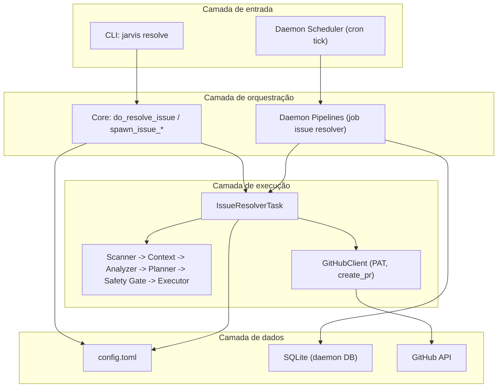

# Levantamento: Evolução Board e Renda (metas, fases, responsabilidades, camadas)

**Data**: 2026-03-11  
**Status**: Documento de referência  
**Objetivo**: Mapear o que podemos fazer, dividir por fases, separar responsabilidades e definir reaproveitamento de camadas antes de implementar as metas de "Jarvis realizando atividades do board" e "caminho para renda".

---

## 1. O que podemos fazer (inventário por camada)

### 1.1 Tabela resumo

| Camada | O que já existe | O que entra no escopo (board/renda) |
|--------|------------------|-------------------------------------|
| **Core (jarvis-rs/core)** | Issue resolver (Scanner, Context, Analyzer, Planner, Safety Gate, Executor), SessionTask, GitHub tools (list_issues, create_pr, etc.), PAT unificado (resolve_github_pat), create PR após push | Config de repos/labels para Scanner; opcional: custo por run |
| **Daemon (jarvis-rs/daemon)** | Scheduler (cron-like), PipelineRunner, PipelineRegistry, Goals, Proposals, ProposalExecutor (11 action types), data sources (WordPress, GSC, AdSense), pipelines (SEO, strategy_analyzer, metrics_collector) | Job "issue resolver" ou pipeline que invoca core; métricas de custo; abstração "fonte de receita" |
| **CLI (jarvis-rs/exec, jarvis-rs/cli)** | `jarvis resolve owner/repo` (e `--issue N`), daemon_cmd (goals, proposals, metrics) | `jarvis resolve` sem args usando config; comando de stats do board |
| **Config** | config.toml, features, github (pat_secret_name, api_base_url), jarvis_home | Nova seção `[issue_resolver]` (repos, labels, limites); opcional: revenue_source |

### 1.2 Detalhamento por camada

**Core (jarvis-rs/core)**

- `issue_resolver/`: Scanner (poll issues por labels), Context (repo structure), Analyzer (LLM), Planner (LLM), Safety Gate, Executor (sub-agent + commit+push+create_pr). Entry: `IssueResolverTask`, `IssueResolverParams`.
- `tools/handlers/github.rs`: `resolve_github_pat`, GitHubClient (create_issue, list_issues, create_pr, etc.).
- Session, TurnContext, Config load, feature `autonomous_issue_resolver`.
- Hoje: owner/repo e labels vêm do request (CLI) ou defaults no código; não há leitura de `[issue_resolver]` no config.

**Daemon (jarvis-rs/daemon)**

- `scheduler.rs`: tick em intervalo, lista pipelines habilitados, enfileira jobs por cron.
- `runner.rs`: executa jobs; `pipeline.rs`: trait Pipeline, PipelineRegistry (pipelines registrados por strategy).
- `executor.rs`: ProposalExecutor com 11 action types (execução de propostas aprovadas).
- `daemon-common`: DaemonDb (SQLite), goals, proposals, pipelines, jobs, logs.
- Data sources: WordPress, Google Search Console, Google AdSense, Google Analytics.
- Não existe hoje pipeline/job que chame o issue resolver do core.

**CLI**

- `jarvis-rs/exec`: comando `resolve` com arg `owner/repo` obrigatório; build_issue_resolver_request.
- `jarvis-rs/cli`: daemon_cmd (goals, proposals, metrics, experiments).
- Não existe: `jarvis resolve` sem argumentos (usando config); nem comando dedicado "board stats".

**Config**

- config.toml: features, github, model, etc. Schema em jarvis-rs/core/config.schema.json.
- Não existe: seção `[issue_resolver]` (repos, required_labels, exclude_labels, max_issues_per_scan).

---

## 2. Responsabilidades (quem faz o quê)

| Domínio | Responsável | Descrição |
|---------|-------------|-----------|
| **Board (fila de trabalho)** | Config + Core | Origem = GitHub Issues. Definição da fila = config `[issue_resolver]` (repos, labels). Core (Scanner) lê config e monta a lista de issues. Quem dispara hoje = CLI; no futuro = daemon job. |
| **Resolução de issue** | Core | `IssueResolverTask` e pipeline completo (scan → analyze → plan → safety → execute). Daemon não duplica lógica; apenas invoca core (ou exec) quando houver job. |
| **Agendamento / loop autônomo** | Daemon | Scheduler + pipelines/jobs. Responsável por "rodar sozinho" em intervalo (cron). Novo job "issue resolver" será registrado aqui e chamará core. |
| **Métricas e custo** | Daemon (persistência) + Core ou Daemon (registro) | Daemon já persiste métricas (SQLite). Novo: registrar custo por execução do issue resolver (tokens/tempo); core ou daemon reporta; daemon-common pode ter tabela/API. |
| **Renda** | Daemon + docs | Daemon já tem AdSense/SEO como fonte de receita. Documentar "fonte de receita" como abstração; qual camada lê/escreve (daemon-common ou config). Goals podem incluir meta "receita mínima". |

**Regra**: Não criar segundo scanner nem segundo executor de issues; o daemon orquestra o que já existe no core.

---

## 3. Camadas reutilizáveis

| Componente | Onde está | Consumido por | Reuso no board/renda |
|------------|-----------|---------------|----------------------|
| IssueScanner, ScannerConfig | core/issue_resolver | IssueResolverTask (core), do_resolve_issue (jarvis.rs) | Scanner continua; config passa a vir de config.toml (repos, labels) em vez de só defaults no código. |
| IssueResolverTask, ImplementationExecutor | core/issue_resolver | spawn_issue_resolver_thread (core) | Nenhuma mudança de contrato; daemon ou CLI invocam. |
| resolve_github_pat, GitHubClient | core/tools/handlers/github, jarvis-rs/github | GitHub tools, do_resolve_issue | PAT e API já unificados; reuso total. |
| Scheduler, PipelineRunner, PipelineRegistry | daemon | main do daemon | Registrar novo pipeline ou job que chama issue resolver (sem reimplementar pipeline no daemon). |
| Goals, Proposals, ProposalExecutor (daemon) | daemon, daemon-common | strategy_analyzer, scheduler | Goals podem receber meta "issues resolvidas" ou "receita"; executor já executa ações; possível nova action type "run_issue_resolver" se for necessário. |
| Config (ConfigToml, load) | core/config | core, exec, daemon (se usar config do Jarvis) | Nova seção `[issue_resolver]`; sem novo loader, só novo bloco no schema e tipos. |

**Nota**: Não criar segundo scanner nem segundo executor de issues; daemon orquestra o que já existe no core (invocando Session/IssueResolverTask ou expondo um entrypoint que o core já oferece).

---

## 4. Fases (objetivo, responsáveis, dependências, critério de conclusão)

### Fase 1 — Board configurável

- **Objetivo**: Definir "o que é o board" em config (repositórios + critérios de issues); Jarvis usa isso como fila sem precisar passar owner/repo na CLI toda vez.
- **Responsáveis**: Core + Config.
- **Dependências**: Nenhuma.
- **Entregas**: (1) Seção `[issue_resolver]` em config.toml (repos, required_labels, exclude_labels, max_issues_per_scan); (2) Scanner e do_resolve_issue leem config; (3) CLI: `jarvis resolve` sem argumentos usa repo(s) do config.
- **Critério de conclusão**: `jarvis resolve` sem args usa repo(s) e labels definidos no config; doc "board = Issues" atualizada.

### Fase 2 — Loop autônomo (Jarvis realizando o board sozinho)

- **Objetivo**: Jarvis dispara sozinho o ciclo "pegar próxima issue → resolver → atualizar issue" em intervalos ou sob demanda.
- **Responsáveis**: Daemon (job) + Core (invocado).
- **Dependências**: Fase 1 (config de repos/labels).
- **Entregas**: (1) Job/pipeline no daemon que invoca issue resolver (lê config, scan, pick first, resolve); (2) Após execução: comentar na issue (resultado/PR ou erro); opcional: atualizar labels; (3) Limite de issues por execução configurável; (4) Doc "board autônomo".
- **Critério de conclusão**: Jarvis resolve pelo menos 1 issue por execução agendada sem comando manual; issue atualizada com comentário (e opcionalmente labels).

### Fase 3 — Métricas e custo

- **Objetivo**: Medir custo operacional (API, tempo) por tarefa; opcionalmente "valor" por issue para comparar com receita depois.
- **Responsáveis**: Daemon ou Core (registro) + daemon-common (persistência).
- **Dependências**: Fase 2 em andamento ou concluída (para ter execuções reais a medir).
- **Entregas**: (1) Registrar por run: tokens/custo estimado, tempo, sucesso/falha; persistir (SQLite ou log); (2) Comando ou dashboard de resumo (ex.: `jarvis board stats`); (3) Doc de métricas.
- **Critério de conclusão**: Custo por execução visível em CLI ou dashboard; doc descreve métricas e como usar.

### Fase 4 — Porta aberta para renda

- **Objetivo**: Arquitetura aberta para "Jarvis gerar renda"; metas palpáveis sem fixar um único modelo de negócio.
- **Responsáveis**: Daemon (abstração) + docs.
- **Dependências**: Pode ser em paralelo à Fase 3 (docs e abstrações).
- **Entregas**: (1) Abstração "fonte de receita" (config ou tipo em daemon-common); (2) Documentar um fluxo de receita automatizado (ex.: SEO/AdSense já existente); (3) Meta de design "receita > custo" em docs; (4) Opcional: goal "receita mínima" no daemon.
- **Critério de conclusão**: Um fluxo de receita documentado; meta "receita > custo" descrita; abstração permitindo plugar outras fontes depois.

---

## 5. Diagrama de camadas

| Camada | Componentes |
|--------|-------------|
| **Entrada** | CLI (comando resolve) ou Daemon Scheduler (job agendado). |
| **Orquestração** | Core (do_resolve_issue, spawn_issue_resolver_thread) e, no futuro, Daemon (job que chama core). |
| **Execução** | IssueResolverTask (core); GitHubClient para API; Executor (commit, push, create_pr). |
| **Dados** | config.toml (repos, labels quando existir `[issue_resolver]`), SQLite do daemon (jobs, logs, goals), GitHub API. |

---

## 6. Referências

- [Autonomous Issue Resolver](../features/autonomous-issue-resolver.md) — pipeline atual, comandos, config.
- [AUTONOMY_IMPLEMENTATION_STATUS.md](../AUTONOMY_IMPLEMENTATION_STATUS.md) — status do daemon, goals, executor.
- [autonomy-roadmap.md](./autonomy-roadmap.md) — visão estratégica, loop autônomo, roadmap de fases.
- [daemon-deploy-alternatives.md](./daemon-deploy-alternatives.md) — alternativas para rodar o daemon (limite de créditos OpenRouter, modelos locais, free tiers).
- Código: `jarvis-rs/core/src/issue_resolver/`, `jarvis-rs/core/src/tools/handlers/github.rs`, `jarvis-rs/daemon/src/scheduler.rs`, `jarvis-rs/daemon/src/pipeline.rs`, `jarvis-rs/daemon/src/runner.rs`.

---

**Última atualização**: 2026-03-11
