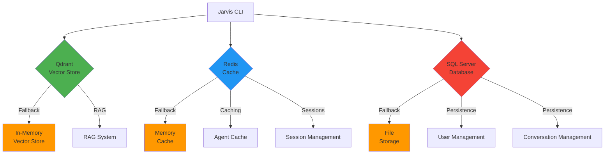
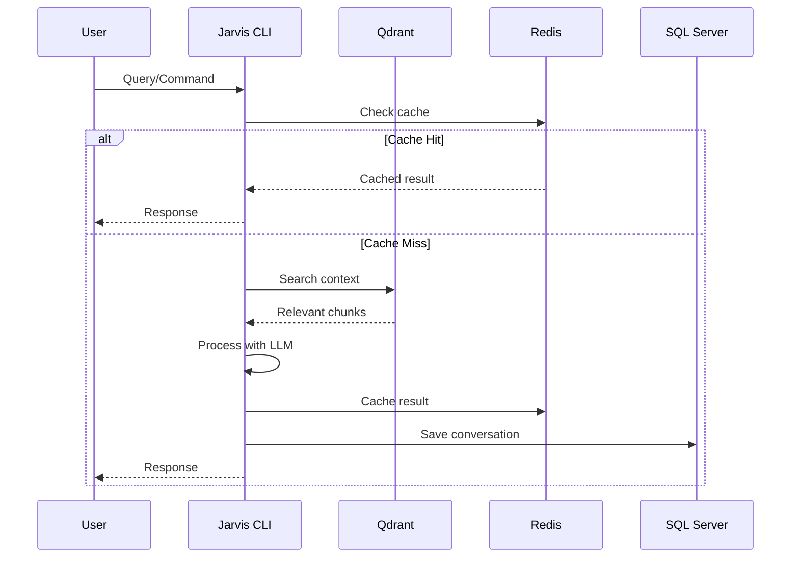

# Visão Geral das Integrações

**Status**: 📝 Planejado  
**Prioridade**: 🔴 Alta  
**Última atualização**: 2026-01-20

## Visão Geral

Este documento fornece uma visão geral das três integrações principais do Jarvis CLI com serviços externos: **Qdrant**, **Redis** e **SQL Server**. Cada integração serve um propósito específico e todas são opcionais, com fallback automático quando os serviços não estão disponíveis.

## Integrações Disponíveis

| Integração | Propósito | Status | Documentação |
|------------|-----------|--------|---------------|
| **Qdrant** | Vector database para RAG | 📝 Planejado | [qdrant-integration.md](./qdrant-integration.md) |
| **Redis** | Cache distribuído | 📝 Planejado | [redis-integration.md](./redis-integration.md) |
| **SQL Server** | Persistência de dados | 📝 Planejado | [sqlserver-integration.md](./sqlserver-integration.md) |

## Arquitetura Geral



## Fluxo de Dados



## Configuração Unificada

### config.toml Completo

```toml
# Qdrant Configuration
[qdrant]
host = "localhost"
port = 6333
collection_name = "jarvis_vectors"
enabled = true
timeout_seconds = 30
embedding_dimension = 1536

[qdrant.connection]
use_tls = false
api_key = ""
max_retries = 3
retry_delay_ms = 1000

# Redis Configuration
[redis]
url = "redis://localhost:6379/0"
enabled = true
ttl_seconds = 3600
l1_ttl_seconds = 3600

[redis.connection]
connect_timeout_seconds = 5
operation_timeout_seconds = 3
max_connections = 10
max_retries = 3
retry_delay_ms = 100

[redis.cache]
agent_result_ttl_seconds = 86400
session_ttl_seconds = 604800
rate_limit_ttl_seconds = 60

# SQL Server Configuration
[sqlserver]
connection_string = "Server=localhost,1433;Database=jarvis;User Id=sa;Password=YourPassword123!;TrustServerCertificate=True;MultipleActiveResultSets=true"
enabled = true

[sqlserver.pool]
max_connections = 10
acquire_timeout_seconds = 5
idle_timeout_seconds = 600
max_lifetime_seconds = 1800

[sqlserver.migration]
auto_migrate = true
migrations_dir = "./migrations"

[sqlserver.transaction]
default_timeout_seconds = 30
isolation_level = "ReadCommitted"
```

### Variáveis de Ambiente

```bash
# Qdrant
QDRANT_HOST=localhost
QDRANT_PORT=6333
QDRANT_COLLECTION_NAME=jarvis_vectors
QDRANT_ENABLED=true

# Redis
REDIS_URL=redis://localhost:6379/0
REDIS_ENABLED=true
REDIS_TTL_SECONDS=3600

# SQL Server
SQLSERVER_CONNECTION_STRING=Server=localhost,1433;Database=jarvis;User Id=sa;Password=...
SQLSERVER_ENABLED=true
```

## Docker Compose para Desenvolvimento

```yaml
version: '3.8'

services:
  # Qdrant Vector Database
  qdrant:
    image: qdrant/qdrant:latest
    container_name: jarvis-qdrant
    ports:
      - "6333:6333"
      - "6334:6334"
    volumes:
      - qdrant_data:/qdrant/storage
    networks:
      - jarvis-network
    healthcheck:
      test: ["CMD-SHELL", "timeout 2 bash -c '</dev/tcp/localhost/6333' || exit 1"]
      interval: 10s
      timeout: 5s
      retries: 5

  # Redis Cache
  redis:
    image: redis:7-alpine
    container_name: jarvis-redis
    ports:
      - "6379:6379"
    volumes:
      - redis_data:/data
    networks:
      - jarvis-network
    command: redis-server --appendonly yes
    healthcheck:
      test: ["CMD", "redis-cli", "ping"]
      interval: 5s
      timeout: 3s
      retries: 5

  # SQL Server Database
  sqlserver:
    image: mcr.microsoft.com/mssql/server:2022-latest
    container_name: jarvis-sqlserver
    environment:
      - ACCEPT_EULA=Y
      - SA_PASSWORD=YourPassword123!
      - MSSQL_PID=Developer
    ports:
      - "1433:1433"
    volumes:
      - sqlserver_data:/var/opt/mssql
    networks:
      - jarvis-network
    healthcheck:
      test: /opt/mssql-tools/bin/sqlcmd -S localhost -U sa -P "YourPassword123!" -Q "SELECT 1" || exit 1
      interval: 10s
      timeout: 10s
      retries: 15

volumes:
  qdrant_data:
  redis_data:
  sqlserver_data:

networks:
  jarvis-network:
    driver: bridge
```

### Iniciando os Serviços

```bash
# Iniciar todos os serviços
docker compose up -d

# Verificar status
docker compose ps

# Ver logs
docker compose logs -f qdrant redis sqlserver

# Parar serviços
docker compose down

# Parar e remover volumes (CUIDADO: apaga dados)
docker compose down -v
```

## Ordem de Implementação Recomendada

### Fase 1: Infraestrutura Básica (Sprint 1)

1. **SQL Server** - Base para persistência
   - Implementar conexão básica
   - Criar sistema de migrations
   - Implementar repositories básicos
   - **Prioridade**: 🔴 Alta (necessário para outras features)

### Fase 2: Cache e Performance (Sprint 2)

2. **Redis** - Cache distribuído
   - Implementar multi-level cache
   - Integrar com agent execution
   - Implementar session persistence
   - **Prioridade**: 🔴 Alta (melhora performance significativamente)

### Fase 3: RAG e Inteligência (Sprint 3)

3. **Qdrant** - Vector database
   - Implementar vector store
   - Integrar com document indexer
   - Implementar busca semântica
   - **Prioridade**: 🟡 Média (melhora qualidade, mas não crítico)

## Dependências Rust

### Cargo.toml

```toml
[dependencies]
# Qdrant
qdrant-client = "1.7"

# Redis
redis = { version = "0.24", features = ["tokio-comp", "connection-manager"] }

# SQL Server
tiberius = { version = "0.12", features = ["tokio", "rustls"] }
tokio-util = { version = "0.7", features = ["compat"] }

# Common
tokio = { version = "1", features = ["full"] }
async-trait = "0.1"
serde = { version = "1", features = ["derive"] }
serde_json = "1"
anyhow = "1"
uuid = { version = "1", features = ["v4", "serde"] }
chrono = { version = "0.4", features = ["serde"] }
```

## Fallback Strategy

Todas as integrações implementam fallback automático quando os serviços não estão disponíveis:

| Integração | Fallback | Comportamento |
|------------|----------|---------------|
| **Qdrant** | In-Memory Vector Store | Funciona localmente, dados não persistem |
| **Redis** | Memory Cache (L1 only) | Cache apenas local, não compartilhado |
| **SQL Server** | File Storage | Dados em arquivos JSON, sem queries complexas |

### Exemplo de Inicialização com Fallback

```rust
use jarvis_core::integrations::{QdrantIntegration, RedisIntegration, SqlServerIntegration};
use jarvis_core::config::Config;

pub struct Integrations {
    pub qdrant: Option<QdrantIntegration>,
    pub redis: Option<RedisIntegration>,
    pub sqlserver: Option<SqlServerIntegration>,
}

impl Integrations {
    pub async fn initialize(config: &Config) -> Self {
        // Qdrant com fallback
        let qdrant = if config.qdrant.enabled {
            match QdrantIntegration::new(&config.qdrant).await {
                Ok(q) if q.is_available().await => Some(q),
                _ => {
                    eprintln!("⚠️  Qdrant não disponível, usando in-memory vector store");
                    None
                }
            }
        } else {
            None
        };
        
        // Redis com fallback
        let redis = if config.redis.enabled {
            match RedisIntegration::new(&config.redis).await {
                Ok(r) if r.is_available().await => Some(r),
                _ => {
                    eprintln!("⚠️  Redis não disponível, usando apenas L1 cache");
                    None
                }
            }
        } else {
            None
        };
        
        // SQL Server com fallback
        let sqlserver = if config.sqlserver.enabled {
            match SqlServerIntegration::new(&config.sqlserver).await {
                Ok(s) if s.is_available().await => Some(s),
                _ => {
                    eprintln!("⚠️  SQL Server não disponível, usando file storage");
                    None
                }
            }
        } else {
            None
        };
        
        Self {
            qdrant,
            redis,
            sqlserver,
        }
    }
}
```

## Casos de Uso

### Desenvolvimento Local

Para desenvolvimento local, você pode usar Docker Compose para iniciar todos os serviços:

```bash
# Iniciar serviços
docker compose up -d

# Verificar saúde
curl http://localhost:6333/health  # Qdrant
redis-cli ping                     # Redis
sqlcmd -S localhost -U sa -P "..." -Q "SELECT 1"  # SQL Server
```

### Produção

Em produção, configure cada serviço separadamente:

- **Qdrant**: Use Qdrant Cloud ou instância gerenciada
- **Redis**: Use Redis Cloud ou instância gerenciada
- **SQL Server**: Use Azure SQL ou instância gerenciada

### Desenvolvimento Sem Serviços Externos

O Jarvis CLI funciona completamente sem serviços externos usando fallbacks:

- **Qdrant**: Usa in-memory vector store
- **Redis**: Usa apenas L1 cache (memory)
- **SQL Server**: Usa file-based storage

## Troubleshooting

### Verificar Conectividade

```bash
# Qdrant
curl http://localhost:6333/health

# Redis
redis-cli ping

# SQL Server
sqlcmd -S localhost -U sa -P "YourPassword" -Q "SELECT 1"
```

### Logs dos Serviços

```bash
# Docker logs
docker logs jarvis-qdrant
docker logs jarvis-redis
docker logs jarvis-sqlserver

# Ou via docker compose
docker compose logs qdrant redis sqlserver
```

### Problemas Comuns

1. **Portas em uso**: Verifique se as portas 6333 (Qdrant), 6379 (Redis), 1433 (SQL Server) estão disponíveis
2. **Credenciais incorretas**: Verifique connection strings e senhas
3. **Firewall**: Verifique se firewall não está bloqueando conexões
4. **Docker network**: Verifique se containers estão na mesma rede Docker

## Próximos Passos

1. **Implementar Traits**: Criar traits/interfaces Rust para cada integração
2. **Criar Módulos**: Organizar código em `jarvis-rs/core/src/integrations/`
3. **Adicionar ao Schema**: Atualizar `config.toml` schema
4. **Testes**: Criar testes de integração para cada serviço
5. **Documentação**: Completar documentação de cada integração

## Referências

- [Qdrant Integration](./qdrant-integration.md) - Documentação detalhada do Qdrant
- [Redis Integration](./redis-integration.md) - Documentação detalhada do Redis
- [SQL Server Integration](./sqlserver-integration.md) - Documentação detalhada do SQL Server
- [RAG Context Management](./rag-context-management.md) - Sistema RAG que usa Qdrant
- [Persistence Layer](./persistence-layer.md) - Camada de persistência que usa SQL Server

---

**Status**: 📝 Planejado  
**Prioridade**: 🔴 Alta  
**Última atualização**: 2026-01-20
