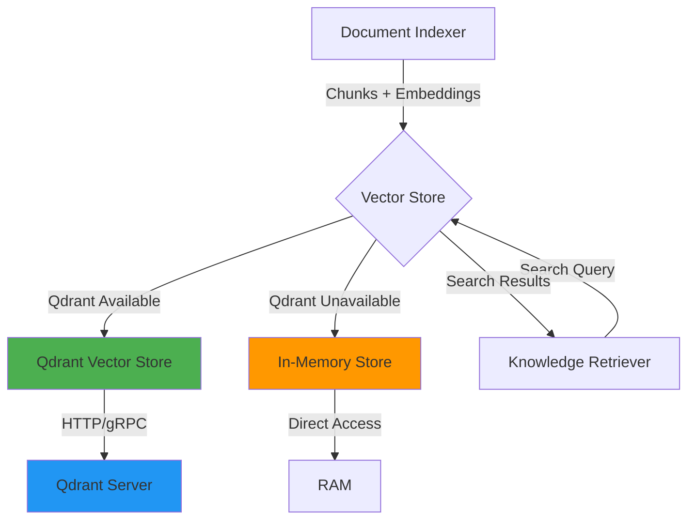
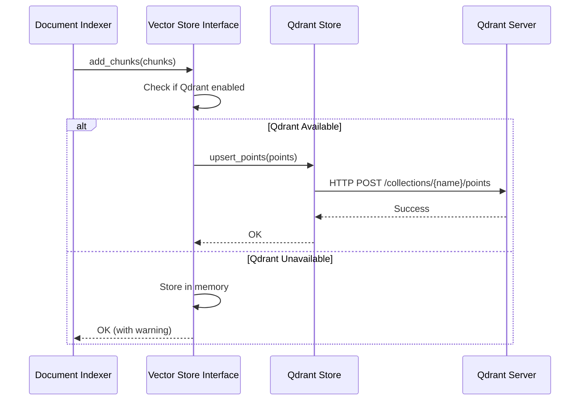
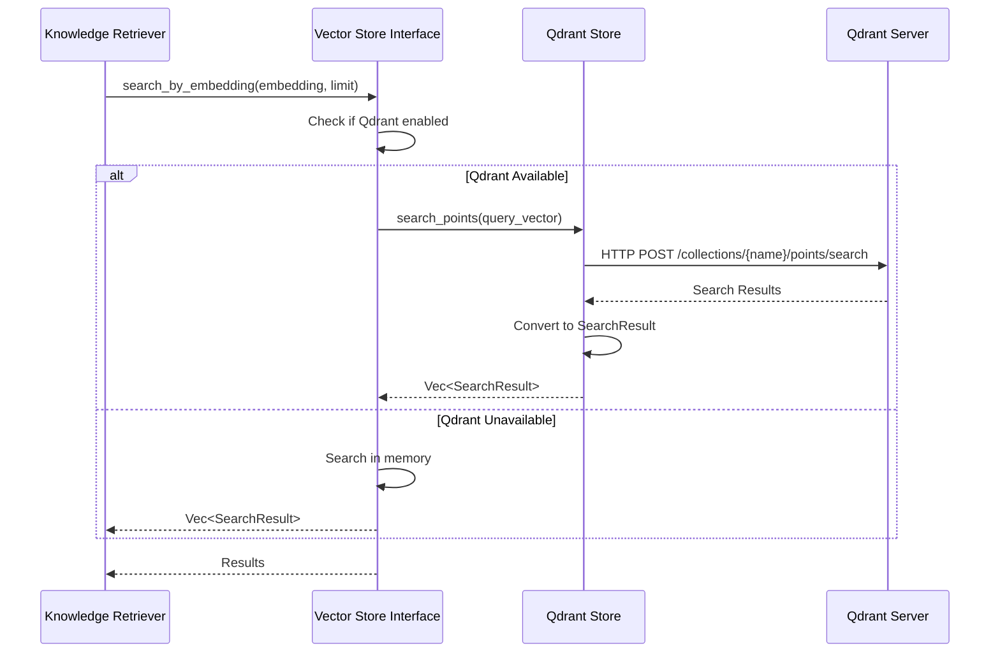

# Integração Qdrant - Vector Database para RAG

**Status**: 📝 Planejado  
**Prioridade**: 🔴 Alta  
**Última atualização**: 2026-01-20

## Visão Geral

O Qdrant é um vector database de alta performance usado para armazenar e buscar embeddings no sistema de RAG (Retrieval Augmented Generation) do Jarvis CLI. Ele permite busca semântica eficiente em grandes volumes de documentos indexados, melhorando significativamente a qualidade das respostas do LLM ao fornecer contexto relevante.

O sistema suporta dois modos de operação:
- **Qdrant**: Vector database distribuído para produção (escala horizontal)
- **In-Memory**: Fallback automático quando Qdrant não está disponível (desenvolvimento/testes)

## Motivação

### Por que Qdrant?

1. **Performance**: Busca vetorial otimizada para milhões de vetores
2. **Escalabilidade**: Suporta clusters distribuídos para alta disponibilidade
3. **Persistência**: Dados sobrevivem a reinicializações da aplicação
4. **Filtragem Avançada**: Suporta filtros por metadados além da busca vetorial
5. **Produção Ready**: Solução robusta para ambientes de produção

### Comparação: Qdrant vs In-Memory

| Aspecto | Qdrant | In-Memory |
|---------|--------|-----------|
| **Persistência** | ✅ Dados persistem | ❌ Dados perdidos ao reiniciar |
| **Escala** | ✅ Milhões de vetores | ⚠️ Limitado pela RAM |
| **Performance** | ✅ Otimizado para busca | ⚠️ Linear scan |
| **Distribuição** | ✅ Suporta clusters | ❌ Single instance |
| **Complexidade** | ⚠️ Requer serviço externo | ✅ Zero dependências |

## Arquitetura

### Integração com RAG System



### Fluxo de Indexação



### Fluxo de Busca



## Especificação Técnica

### Trait VectorStore

```rust
use async_trait::async_trait;
use anyhow::Result;

#[async_trait]
pub trait VectorStore: Send + Sync {
    /// Adiciona ou atualiza chunks no vector store
    async fn add_chunks(
        &self,
        chunks: Vec<DocumentChunk>,
    ) -> Result<()>;
    
    /// Busca por texto (converte para embedding internamente)
    async fn search(
        &self,
        query: &str,
        limit: usize,
    ) -> Result<Vec<SearchResult>>;
    
    /// Busca por embedding vetorial
    async fn search_by_embedding(
        &self,
        embedding: &[f32],
        limit: usize,
    ) -> Result<Vec<SearchResult>>;
    
    /// Busca com filtros de metadados
    async fn search_with_filter(
        &self,
        embedding: &[f32],
        filter: &MetadataFilter,
        limit: usize,
    ) -> Result<Vec<SearchResult>>;
    
    /// Remove chunks por documento
    async fn remove_by_document(
        &self,
        document_path: &Path,
    ) -> Result<()>;
    
    /// Verifica se o store está disponível
    async fn is_available(&self) -> bool;
}
```

### Implementação QdrantVectorStore

```rust
use qdrant_client::prelude::*;
use qdrant_client::qdrant::{
    vectors_config::Config,
    VectorParams,
    VectorsConfig,
    PointStruct,
    Filter,
    FieldCondition,
    MatchValue,
    ScoredPoint,
};
use std::collections::HashMap;

pub struct QdrantVectorStore {
    client: QdrantClient,
    collection_name: String,
    embedding_dimension: usize,
}

impl QdrantVectorStore {
    pub async fn new(
        host: &str,
        port: u16,
        collection_name: String,
        embedding_dimension: usize,
    ) -> Result<Self> {
        let client = QdrantClient::from_url(&format!("http://{}:{}", host, port))
            .build()?;
        
        // Criar collection se não existir
        let collection_exists = client
            .collection_exists(&collection_name)
            .await?;
        
        if !collection_exists {
            client
                .create_collection(&CreateCollection {
                    collection_name: collection_name.clone(),
                    vectors_config: Some(VectorsConfig {
                        config: Some(Config::Params(VectorParams {
                            size: embedding_dimension as u64,
                            distance: Distance::Cosine as i32,
                            ..Default::default()
                        })),
                    }),
                    ..Default::default()
                })
                .await?;
        }
        
        Ok(Self {
            client,
            collection_name,
            embedding_dimension,
        })
    }
    
    fn point_from_chunk(&self, chunk: &DocumentChunk) -> Result<PointStruct> {
        let embedding = chunk.embedding.as_ref()
            .ok_or_else(|| anyhow::anyhow!("Chunk missing embedding"))?;
        
        let mut payload: HashMap<String, Value> = HashMap::new();
        payload.insert("document_path".to_string(), chunk.document_path.to_string_lossy().into());
        payload.insert("content".to_string(), chunk.content.clone().into());
        payload.insert("start_line".to_string(), chunk.start_line.into());
        payload.insert("end_line".to_string(), chunk.end_line.into());
        payload.insert("chunk_index".to_string(), chunk.chunk_index.into());
        
        // Adicionar metadados customizados
        for (key, value) in &chunk.metadata {
            payload.insert(key.clone(), serde_json::to_value(value)?);
        }
        
        Ok(PointStruct::new(
            chunk.id.to_string(),
            embedding.clone(),
            payload,
        ))
    }
}

#[async_trait]
impl VectorStore for QdrantVectorStore {
    async fn add_chunks(&self, chunks: Vec<DocumentChunk>) -> Result<()> {
        let points: Result<Vec<PointStruct>> = chunks
            .iter()
            .map(|chunk| self.point_from_chunk(chunk))
            .collect();
        
        self.client
            .upsert_points(
                &self.collection_name,
                None,
                points?,
                None,
            )
            .await?;
        
        Ok(())
    }
    
    async fn search_by_embedding(
        &self,
        embedding: &[f32],
        limit: usize,
    ) -> Result<Vec<SearchResult>> {
        let search_result = self.client
            .search_points(&SearchPoints {
                collection_name: self.collection_name.clone(),
                vector: embedding.to_vec(),
                limit: limit as u64,
                with_payload: Some(true.into()),
                ..Default::default()
            })
            .await?;
        
        let results: Vec<SearchResult> = search_result
            .result
            .into_iter()
            .map(|point| self.scored_point_to_result(point))
            .collect();
        
        Ok(results)
    }
    
    async fn search_with_filter(
        &self,
        embedding: &[f32],
        filter: &MetadataFilter,
        limit: usize,
    ) -> Result<Vec<SearchResult>> {
        let qdrant_filter = self.metadata_filter_to_qdrant(filter)?;
        
        let search_result = self.client
            .search_points(&SearchPoints {
                collection_name: self.collection_name.clone(),
                vector: embedding.to_vec(),
                filter: Some(qdrant_filter),
                limit: limit as u64,
                with_payload: Some(true.into()),
                ..Default::default()
            })
            .await?;
        
        let results: Vec<SearchResult> = search_result
            .result
            .into_iter()
            .map(|point| self.scored_point_to_result(point))
            .collect();
        
        Ok(results)
    }
    
    async fn remove_by_document(&self, document_path: &Path) -> Result<()> {
        let filter = Filter::must([
            FieldCondition {
                key: "document_path".to_string(),
                r#match: Some(MatchValue {
                    value: Some(qdrant_client::qdrant::r#match::Value::Value(
                        document_path.to_string_lossy().to_string()
                    )),
                }),
                ..Default::default()
            }
        ]);
        
        self.client
            .delete_points(
                &self.collection_name,
                None,
                &FilterSelector { filter: Some(filter) },
                None,
            )
            .await?;
        
        Ok(())
    }
    
    async fn is_available(&self) -> bool {
        self.client.health_check().await.is_ok()
    }
    
    // Implementações de search e outros métodos...
}
```

### Estruturas de Dados

```rust
use uuid::Uuid;
use std::path::PathBuf;
use serde_json::Value;

pub struct DocumentChunk {
    pub id: Uuid,
    pub document_path: PathBuf,
    pub content: String,
    pub start_line: usize,
    pub end_line: usize,
    pub chunk_index: usize,
    pub embedding: Option<Vec<f32>>,
    pub metadata: HashMap<String, Value>,
}

pub struct SearchResult {
    pub chunk: DocumentChunk,
    pub score: f32,
    pub relevance: RelevanceScore,
}

pub enum RelevanceScore {
    High(f32),    // > 0.8
    Medium(f32),  // 0.5 - 0.8
    Low(f32),     // < 0.5
}

pub struct MetadataFilter {
    pub document_path: Option<String>,
    pub language: Option<String>,
    pub tags: Option<Vec<String>>,
    pub date_range: Option<(DateTime<Utc>, DateTime<Utc>)>,
}
```

## Configuração

### config.toml

```toml
[qdrant]
# Host do servidor Qdrant
host = "localhost"

# Porta do servidor Qdrant
port = 6333

# Nome da collection (padrão: "jarvis_vectors")
collection_name = "jarvis_vectors"

# Habilitar Qdrant (se false, usa in-memory)
enabled = true

# Timeout para operações (segundos)
timeout_seconds = 30

# Dimension dos embeddings (deve corresponder ao modelo usado)
embedding_dimension = 1536

# Configurações de conexão
[qdrant.connection]
# Usar HTTPS
use_tls = false

# API key (opcional, para Qdrant Cloud)
api_key = ""

# Retry configuration
max_retries = 3
retry_delay_ms = 1000
```

### Variáveis de Ambiente

```bash
# Qdrant connection
QDRANT_HOST=localhost
QDRANT_PORT=6333
QDRANT_COLLECTION_NAME=jarvis_vectors
QDRANT_ENABLED=true
QDRANT_API_KEY=your-api-key-here  # Opcional para Qdrant Cloud
```

## Exemplos de Uso

### Exemplo 1: Inicialização com Fallback

```rust
use jarvis_core::vector_store::{VectorStore, QdrantVectorStore, InMemoryVectorStore};
use jarvis_core::config::Config;

async fn create_vector_store(config: &Config) -> Box<dyn VectorStore> {
    if config.qdrant.enabled {
        match QdrantVectorStore::new(
            &config.qdrant.host,
            config.qdrant.port,
            config.qdrant.collection_name.clone(),
            config.qdrant.embedding_dimension,
        ).await {
            Ok(store) => {
                if store.is_available().await {
                    return Box::new(store);
                }
                eprintln!("⚠️  Qdrant não disponível, usando in-memory");
            }
            Err(e) => {
                eprintln!("⚠️  Erro ao conectar ao Qdrant: {}, usando in-memory", e);
            }
        }
    }
    
    // Fallback para in-memory
    Box::new(InMemoryVectorStore::new())
}
```

### Exemplo 2: Indexação de Documentos

```rust
use jarvis_core::document_indexer::DocumentIndexer;
use jarvis_core::vector_store::VectorStore;

async fn index_documents(
    indexer: &dyn DocumentIndexer,
    vector_store: &dyn VectorStore,
    path: &Path,
) -> Result<()> {
    // Indexar documento
    let chunks = indexer.index_document(path, &content).await?;
    
    // Gerar embeddings (usando embedding service)
    let chunks_with_embeddings: Vec<DocumentChunk> = chunks
        .into_iter()
        .map(|chunk| {
            let embedding = embedding_service.generate(&chunk.content).await?;
            DocumentChunk {
                embedding: Some(embedding),
                ..chunk
            }
        })
        .collect();
    
    // Adicionar ao vector store
    vector_store.add_chunks(chunks_with_embeddings).await?;
    
    Ok(())
}
```

### Exemplo 3: Busca Semântica

```rust
use jarvis_core::vector_store::VectorStore;
use jarvis_core::embedding::EmbeddingService;

async fn search_context(
    vector_store: &dyn VectorStore,
    embedding_service: &EmbeddingService,
    query: &str,
    limit: usize,
) -> Result<Vec<SearchResult>> {
    // Gerar embedding da query
    let query_embedding = embedding_service.generate(query).await?;
    
    // Buscar no vector store
    let results = vector_store
        .search_by_embedding(&query_embedding, limit)
        .await?;
    
    // Filtrar por relevância mínima
    let filtered: Vec<SearchResult> = results
        .into_iter()
        .filter(|r| r.score > 0.5)
        .collect();
    
    Ok(filtered)
}
```

### Exemplo 4: Busca com Filtros

```rust
use jarvis_core::vector_store::{VectorStore, MetadataFilter};

async fn search_by_language(
    vector_store: &dyn VectorStore,
    query_embedding: &[f32],
    language: &str,
) -> Result<Vec<SearchResult>> {
    let filter = MetadataFilter {
        language: Some(language.to_string()),
        ..Default::default()
    };
    
    vector_store
        .search_with_filter(query_embedding, &filter, 10)
        .await
}
```

## Considerações de Implementação

### Dependências

**Crates Rust necessários:**

```toml
[dependencies]
# Qdrant client
qdrant-client = "1.7"

# Async runtime
tokio = { version = "1", features = ["full"] }
async-trait = "0.1"

# Serialização
serde = { version = "1", features = ["derive"] }
serde_json = "1"

# Error handling
anyhow = "1"
thiserror = "1"

# Utilities
uuid = { version = "1", features = ["v4", "serde"] }
```

### Desafios Técnicos

1. **Gerenciamento de Conexão**
   - **Desafio**: Manter conexão estável com Qdrant
   - **Solução**: Implementar retry logic e health checks periódicos
   - **Fallback**: Usar in-memory quando Qdrant indisponível

2. **Sincronização de Schema**
   - **Desafio**: Garantir que collection existe com schema correto
   - **Solução**: Verificar/criar collection na inicialização
   - **Migration**: Suportar atualização de schema quando necessário

3. **Batch Operations**
   - **Desafio**: Indexar muitos documentos eficientemente
   - **Solução**: Processar em batches (ex: 100 pontos por vez)
   - **Otimização**: Usar operações assíncronas paralelas

4. **Filtros Complexos**
   - **Desafio**: Converter filtros Rust para formato Qdrant
   - **Solução**: Criar builder pattern para MetadataFilter
   - **Extensibilidade**: Suportar novos tipos de filtros facilmente

### Performance

- **Batch Upsert**: Agrupar múltiplos pontos em uma única requisição
- **Connection Pooling**: Reutilizar conexões HTTP/gRPC
- **Async Operations**: Todas operações são assíncronas
- **Caching**: Cachear resultados de busca frequentes (integrar com Redis)

### Segurança

- **TLS**: Suportar HTTPS para conexões seguras
- **API Keys**: Autenticação com Qdrant Cloud
- **Validação**: Validar inputs antes de enviar ao Qdrant
- **Rate Limiting**: Implementar rate limiting para evitar sobrecarga

### Troubleshooting

**Problema**: Qdrant não responde
- Verificar se serviço está rodando: `curl http://localhost:6333/health`
- Verificar logs do Qdrant
- Verificar conectividade de rede
- Fallback automático para in-memory

**Problema**: Collection não existe
- Verificar logs de inicialização
- Collection é criada automaticamente na primeira inicialização
- Verificar permissões de escrita

**Problema**: Busca retorna resultados vazios
- Verificar se documentos foram indexados
- Verificar dimensão dos embeddings (deve corresponder ao configurado)
- Verificar se embeddings foram gerados corretamente

## Roadmap de Implementação

### Fase 1: Core Integration (Sprint 1)

- [ ] Adicionar dependência `qdrant-client`
- [ ] Implementar trait `VectorStore`
- [ ] Implementar `QdrantVectorStore` básico
- [ ] Implementar fallback para `InMemoryVectorStore`
- [ ] Adicionar configuração ao `config.toml`

### Fase 2: Advanced Features (Sprint 2)

- [ ] Implementar filtros de metadados
- [ ] Adicionar suporte a batch operations
- [ ] Implementar retry logic e health checks
- [ ] Adicionar métricas e logging

### Fase 3: Production Ready (Sprint 3)

- [ ] Suporte a TLS/HTTPS
- [ ] Suporte a Qdrant Cloud (API keys)
- [ ] Implementar connection pooling
- [ ] Adicionar testes de integração
- [ ] Documentação de deployment

### Fase 4: Optimization (Sprint 4)

- [ ] Otimizar batch sizes baseado em performance
- [ ] Implementar cache de buscas frequentes
- [ ] Adicionar métricas de performance
- [ ] Suporte a múltiplas collections

## Referências

### Código Base (.NET)

- `Jarvis.Infrastructure/DependencyInjection/InfrastructureInjection.cs` (linhas 1042-1052) - Configuração Qdrant
- `Jarvis.Infrastructure/Services/QdrantVectorStore.cs` - Implementação Qdrant
- `Jarvis.Infrastructure/Services/IVectorStore.cs` - Interface VectorStore

### Documentação Externa

- [Qdrant Documentation](https://qdrant.tech/documentation/)
- [Qdrant Rust Client](https://docs.rs/qdrant-client/)
- [Vector Databases Guide](https://www.pinecone.io/learn/vector-database/)
- [RAG Architecture](https://www.pinecone.io/learn/retrieval-augmented-generation/)

### Recursos Adicionais

- [Qdrant Cloud](https://cloud.qdrant.io/) - Serviço gerenciado
- [Qdrant Docker Image](https://hub.docker.com/r/qdrant/qdrant) - Para desenvolvimento local
- [Qdrant Performance Tuning](https://qdrant.tech/documentation/guides/performance/) - Otimização

---

**Status**: 📝 Planejado  
**Prioridade**: 🔴 Alta  
**Última atualização**: 2026-01-20
