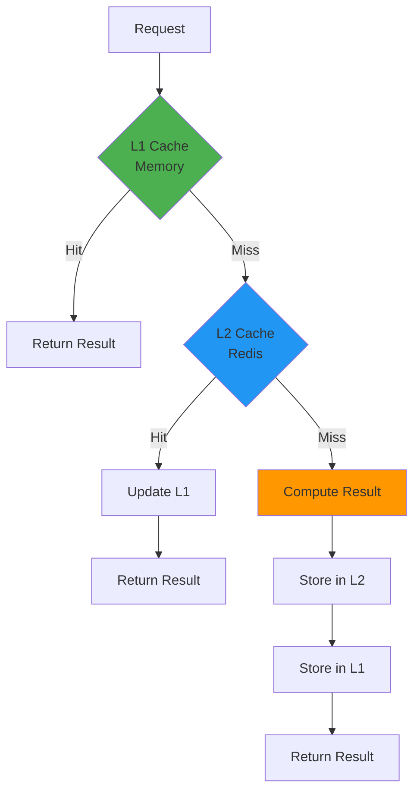
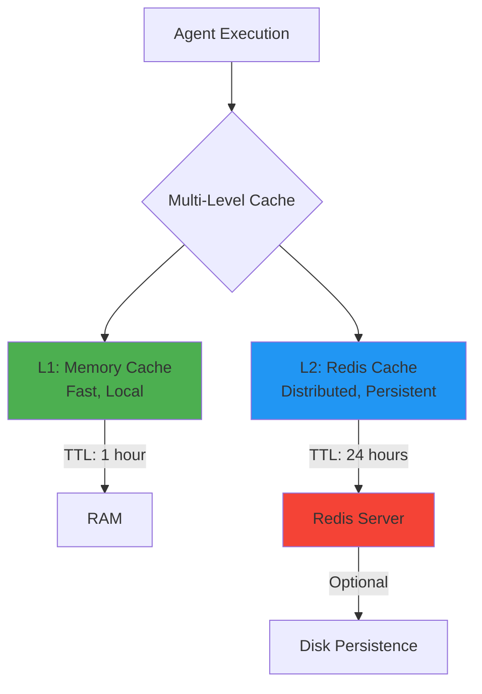
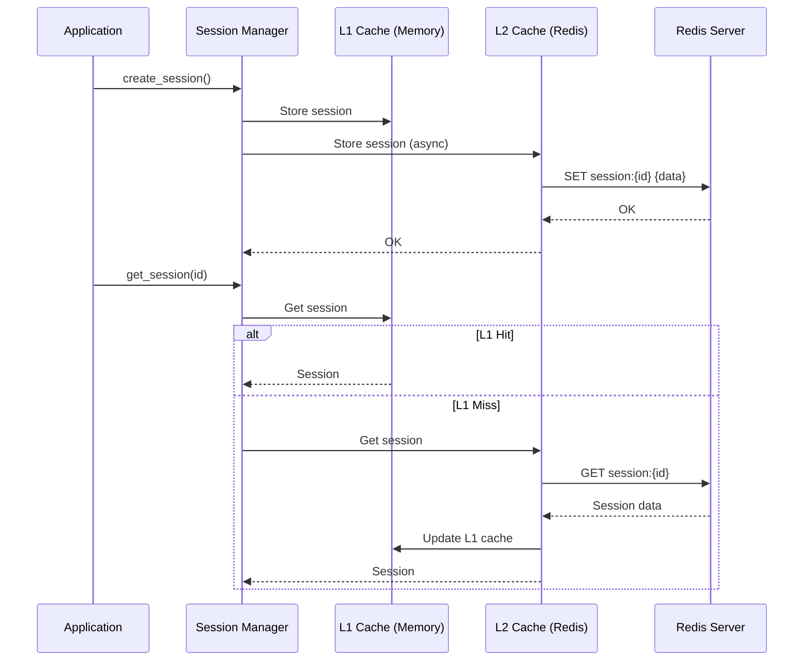

# Integração Redis - Cache Distribuído

**Status**: 📝 Planejado  
**Prioridade**: 🔴 Alta  
**Última atualização**: 2026-01-20

## Visão Geral

O Redis é usado como cache distribuído (L2) no Jarvis CLI para armazenar resultados de agentes, sessões de usuários e outros dados que precisam ser compartilhados entre múltiplas instâncias ou persistir entre reinicializações. O sistema implementa um cache multi-nível (L1: Memory, L2: Redis) que oferece fallback automático quando Redis não está disponível.

O Redis é usado para:
- **Agent Result Caching**: Cache de resultados de agentes para evitar reprocessamento
- **Session Persistence**: Armazenamento de sessões de usuários
- **Distributed Locking**: Locks distribuídos para operações críticas (futuro)
- **Rate Limiting**: Controle de taxa distribuído (futuro)

## Motivação

### Por que Redis?

1. **Performance**: Cache em memória extremamente rápido
2. **Distribuição**: Compartilhado entre múltiplas instâncias do CLI
3. **Persistência**: Dados podem persistir entre reinicializações
4. **Estruturas de Dados**: Suporta strings, hashes, sets, sorted sets
5. **Pub/Sub**: Suporte a mensageria (futuro)

### Cache Multi-Nível

O sistema implementa cache em dois níveis:

- **L1 (Memory)**: Cache local em memória, extremamente rápido mas limitado à instância
- **L2 (Redis)**: Cache distribuído, compartilhado entre instâncias, com persistência opcional



## Arquitetura

### Multi-Level Cache Architecture



### Session Persistence Flow



## Especificação Técnica

### Trait DistributedCache

```rust
use async_trait::async_trait;
use anyhow::Result;
use serde::{Serialize, Deserialize};
use std::time::Duration;

#[async_trait]
pub trait DistributedCache: Send + Sync {
    /// Obtém valor do cache
    async fn get<T: for<'de> Deserialize<'de>>(
        &self,
        key: &str,
    ) -> Result<Option<T>>;
    
    /// Armazena valor no cache com TTL
    async fn set<T: Serialize>(
        &self,
        key: &str,
        value: &T,
        ttl: Option<Duration>,
    ) -> Result<()>;
    
    /// Remove valor do cache
    async fn delete(&self, key: &str) -> Result<()>;
    
    /// Verifica se chave existe
    async fn exists(&self, key: &str) -> Result<bool>;
    
    /// Incrementa valor numérico
    async fn increment(&self, key: &str, amount: i64) -> Result<i64>;
    
    /// Define TTL para chave existente
    async fn expire(&self, key: &str, ttl: Duration) -> Result<()>;
    
    /// Verifica se cache está disponível
    async fn is_available(&self) -> bool;
}
```

### Multi-Level Cache Implementation

```rust
use std::sync::Arc;
use tokio::sync::RwLock;
use std::collections::HashMap;
use std::time::{Duration, Instant};
use serde::{Serialize, Deserialize};

pub struct CacheEntry<T> {
    value: T,
    expires_at: Option<Instant>,
}

pub struct MultiLevelCache {
    l1: Arc<RwLock<HashMap<String, CacheEntry<String>>>>,
    l2: Option<Arc<dyn DistributedCache>>,
    l1_ttl: Duration,
    l2_ttl: Duration,
}

impl MultiLevelCache {
    pub fn new(
        l2: Option<Arc<dyn DistributedCache>>,
        l1_ttl: Duration,
        l2_ttl: Duration,
    ) -> Self {
        Self {
            l1: Arc::new(RwLock::new(HashMap::new())),
            l2,
            l1_ttl,
            l2_ttl,
        }
    }
    
    pub async fn get<T: for<'de> Deserialize<'de>>(
        &self,
        key: &str,
    ) -> Result<Option<T>> {
        // Try L1 first
        {
            let l1 = self.l1.read().await;
            if let Some(entry) = l1.get(key) {
                if let Some(expires_at) = entry.expires_at {
                    if expires_at > Instant::now() {
                        return Ok(Some(serde_json::from_str(&entry.value)?));
                    }
                } else {
                    return Ok(Some(serde_json::from_str(&entry.value)?));
                }
            }
        }
        
        // Try L2 if available
        if let Some(l2) = &self.l2 {
            if let Some(value) = l2.get::<String>(key).await? {
                // Update L1 cache
                {
                    let mut l1 = self.l1.write().await;
                    l1.insert(
                        key.to_string(),
                        CacheEntry {
                            value: value.clone(),
                            expires_at: Some(Instant::now() + self.l1_ttl),
                        },
                    );
                }
                return Ok(Some(serde_json::from_str(&value)?));
            }
        }
        
        Ok(None)
    }
    
    pub async fn set<T: Serialize>(
        &self,
        key: &str,
        value: &T,
    ) -> Result<()> {
        let serialized = serde_json::to_string(value)?;
        
        // Store in L1
        {
            let mut l1 = self.l1.write().await;
            l1.insert(
                key.to_string(),
                CacheEntry {
                    value: serialized.clone(),
                    expires_at: Some(Instant::now() + self.l1_ttl),
                },
            );
        }
        
        // Store in L2 if available
        if let Some(l2) = &self.l2 {
            l2.set(key, &serialized, Some(self.l2_ttl)).await?;
        }
        
        Ok(())
    }
    
    pub async fn delete(&self, key: &str) -> Result<()> {
        // Remove from L1
        {
            let mut l1 = self.l1.write().await;
            l1.remove(key);
        }
        
        // Remove from L2 if available
        if let Some(l2) = &self.l2 {
            l2.delete(key).await?;
        }
        
        Ok(())
    }
}
```

### Redis Implementation

```rust
use redis::AsyncCommands;
use redis::Client as RedisClient;
use std::time::Duration;

pub struct RedisCache {
    client: RedisClient,
}

impl RedisCache {
    pub async fn new(url: &str) -> Result<Self> {
        let client = RedisClient::open(url)?;
        
        // Test connection
        let mut conn = client.get_async_connection().await?;
        redis::cmd("PING").query_async::<_, String>(&mut conn).await?;
        
        Ok(Self { client })
    }
}

#[async_trait]
impl DistributedCache for RedisCache {
    async fn get<T: for<'de> Deserialize<'de>>(
        &self,
        key: &str,
    ) -> Result<Option<T>> {
        let mut conn = self.client.get_async_connection().await?;
        let value: Option<String> = conn.get(key).await?;
        
        match value {
            Some(v) => Ok(Some(serde_json::from_str(&v)?)),
            None => Ok(None),
        }
    }
    
    async fn set<T: Serialize>(
        &self,
        key: &str,
        value: &T,
        ttl: Option<Duration>,
    ) -> Result<()> {
        let mut conn = self.client.get_async_connection().await?;
        let serialized = serde_json::to_string(value)?;
        
        if let Some(ttl) = ttl {
            conn.set_ex(key, serialized, ttl.as_secs() as usize).await?;
        } else {
            conn.set(key, serialized).await?;
        }
        
        Ok(())
    }
    
    async fn delete(&self, key: &str) -> Result<()> {
        let mut conn = self.client.get_async_connection().await?;
        conn.del(key).await?;
        Ok(())
    }
    
    async fn exists(&self, key: &str) -> Result<bool> {
        let mut conn = self.client.get_async_connection().await?;
        let exists: bool = conn.exists(key).await?;
        Ok(exists)
    }
    
    async fn increment(&self, key: &str, amount: i64) -> Result<i64> {
        let mut conn = self.client.get_async_connection().await?;
        let value: i64 = conn.incr(key, amount).await?;
        Ok(value)
    }
    
    async fn expire(&self, key: &str, ttl: Duration) -> Result<()> {
        let mut conn = self.client.get_async_connection().await?;
        conn.expire(key, ttl.as_secs() as usize).await?;
        Ok(())
    }
    
    async fn is_available(&self) -> bool {
        match self.client.get_async_connection().await {
            Ok(mut conn) => {
                redis::cmd("PING").query_async::<_, String>(&mut conn).await.is_ok()
            }
            Err(_) => false,
        }
    }
}
```

### Agent Result Caching

```rust
use serde::{Serialize, Deserialize};
use uuid::Uuid;

#[derive(Serialize, Deserialize, Clone)]
pub struct AgentResult {
    pub agent_name: String,
    pub input: String,
    pub output: String,
    pub metadata: HashMap<String, serde_json::Value>,
    pub cached_at: DateTime<Utc>,
}

pub struct AgentCache {
    cache: MultiLevelCache,
}

impl AgentCache {
    pub fn new(cache: MultiLevelCache) -> Self {
        Self { cache }
    }
    
    pub async fn get_cached_result(
        &self,
        agent_name: &str,
        input: &str,
    ) -> Result<Option<AgentResult>> {
        let key = format!("agent:{}:{}", agent_name, self.hash_input(input));
        self.cache.get(&key).await
    }
    
    pub async fn cache_result(
        &self,
        agent_name: &str,
        input: &str,
        result: &AgentResult,
    ) -> Result<()> {
        let key = format!("agent:{}:{}", agent_name, self.hash_input(input));
        self.cache.set(&key, result).await
    }
    
    fn hash_input(&self, input: &str) -> String {
        use sha2::{Sha256, Digest};
        let mut hasher = Sha256::new();
        hasher.update(input.as_bytes());
        format!("{:x}", hasher.finalize())
    }
}
```

### Session Persistence

```rust
use serde::{Serialize, Deserialize};

#[derive(Serialize, Deserialize)]
pub struct Session {
    pub session_id: Uuid,
    pub user_id: Option<String>,
    pub messages: Vec<Message>,
    pub metadata: HashMap<String, serde_json::Value>,
    pub created_at: DateTime<Utc>,
    pub updated_at: DateTime<Utc>,
}

pub struct PersistentSessionManager {
    cache: MultiLevelCache,
}

impl PersistentSessionManager {
    pub async fn create_session(&self, session: Session) -> Result<()> {
        let key = format!("session:{}", session.session_id);
        self.cache.set(&key, &session).await
    }
    
    pub async fn get_session(&self, session_id: &Uuid) -> Result<Option<Session>> {
        let key = format!("session:{}", session_id);
        self.cache.get(&key).await
    }
    
    pub async fn update_session(&self, session: &Session) -> Result<()> {
        let mut updated = session.clone();
        updated.updated_at = Utc::now();
        let key = format!("session:{}", session.session_id);
        self.cache.set(&key, &updated).await
    }
    
    pub async fn delete_session(&self, session_id: &Uuid) -> Result<()> {
        let key = format!("session:{}", session_id);
        self.cache.delete(&key).await
    }
}
```

## Configuração

### config.toml

```toml
[redis]
# URL de conexão Redis
url = "redis://localhost:6379/0"

# Habilitar Redis (se false, usa apenas L1 cache)
enabled = true

# TTL padrão para L2 cache (segundos)
ttl_seconds = 3600

# TTL para L1 cache (segundos)
l1_ttl_seconds = 3600

# Configurações de conexão
[redis.connection]
# Timeout de conexão (segundos)
connect_timeout_seconds = 5

# Timeout de operação (segundos)
operation_timeout_seconds = 3

# Máximo de conexões no pool
max_connections = 10

# Retry configuration
max_retries = 3
retry_delay_ms = 100

# Configurações específicas por tipo de cache
[redis.cache]
# TTL para agent results (segundos)
agent_result_ttl_seconds = 86400  # 24 horas

# TTL para sessions (segundos)
session_ttl_seconds = 604800  # 7 dias

# TTL para rate limiting (segundos)
rate_limit_ttl_seconds = 60
```

### Variáveis de Ambiente

```bash
# Redis connection
REDIS_URL=redis://localhost:6379/0
REDIS_ENABLED=true
REDIS_TTL_SECONDS=3600

# Redis connection pool
REDIS_MAX_CONNECTIONS=10
REDIS_CONNECT_TIMEOUT_SECONDS=5
```

## Exemplos de Uso

### Exemplo 1: Inicialização com Fallback

```rust
use jarvis_core::cache::{MultiLevelCache, RedisCache, DistributedCache};
use jarvis_core::config::Config;
use std::sync::Arc;
use std::time::Duration;

async fn create_cache(config: &Config) -> MultiLevelCache {
    let l2: Option<Arc<dyn DistributedCache>> = if config.redis.enabled {
        match RedisCache::new(&config.redis.url).await {
            Ok(redis) => {
                if redis.is_available().await {
                    Some(Arc::new(redis))
                } else {
                    eprintln!("⚠️  Redis não disponível, usando apenas L1 cache");
                    None
                }
            }
            Err(e) => {
                eprintln!("⚠️  Erro ao conectar ao Redis: {}, usando apenas L1 cache", e);
                None
            }
        }
    } else {
        None
    };
    
    MultiLevelCache::new(
        l2,
        Duration::from_secs(config.redis.l1_ttl_seconds),
        Duration::from_secs(config.redis.ttl_seconds),
    )
}
```

### Exemplo 2: Agent Result Caching

```rust
use jarvis_core::cache::AgentCache;

async fn execute_agent_with_cache(
    cache: &AgentCache,
    agent_name: &str,
    input: &str,
) -> Result<String> {
    // Verificar cache primeiro
    if let Some(cached) = cache.get_cached_result(agent_name, input).await? {
        return Ok(cached.output);
    }
    
    // Executar agente
    let result = execute_agent(agent_name, input).await?;
    
    // Cachear resultado
    let agent_result = AgentResult {
        agent_name: agent_name.to_string(),
        input: input.to_string(),
        output: result.clone(),
        metadata: HashMap::new(),
        cached_at: Utc::now(),
    };
    cache.cache_result(agent_name, input, &agent_result).await?;
    
    Ok(result)
}
```

### Exemplo 3: Session Management

```rust
use jarvis_core::cache::PersistentSessionManager;
use uuid::Uuid;

async fn resume_session(
    session_manager: &PersistentSessionManager,
    session_id: &Uuid,
) -> Result<Option<Session>> {
    session_manager.get_session(session_id).await
}

async fn save_session(
    session_manager: &PersistentSessionManager,
    session: Session,
) -> Result<()> {
    session_manager.create_session(session).await
}
```

### Exemplo 4: Distributed Locking (Futuro)

```rust
use jarvis_core::cache::DistributedCache;
use std::time::Duration;

pub struct DistributedLock {
    cache: Arc<dyn DistributedCache>,
    key: String,
    lock_id: String,
}

impl DistributedLock {
    pub async fn acquire(
        cache: Arc<dyn DistributedCache>,
        key: &str,
        ttl: Duration,
    ) -> Result<Option<Self>> {
        let lock_id = Uuid::new_v4().to_string();
        let lock_key = format!("lock:{}", key);
        
        // Tentar adquirir lock usando SET NX
        // (implementação requer comandos Redis específicos)
        
        Ok(Some(Self {
            cache,
            key: key.to_string(),
            lock_id,
        }))
    }
    
    pub async fn release(&self) -> Result<()> {
        let lock_key = format!("lock:{}", self.key);
        self.cache.delete(&lock_key).await
    }
}
```

## Considerações de Implementação

### Dependências

**Crates Rust necessários:**

```toml
[dependencies]
# Redis client
redis = { version = "0.24", features = ["tokio-comp", "connection-manager"] }

# Async runtime
tokio = { version = "1", features = ["full"] }
async-trait = "0.1"

# Serialização
serde = { version = "1", features = ["derive"] }
serde_json = "1"

# Error handling
anyhow = "1"
thiserror = "1"

# Utilities
uuid = { version = "1", features = ["v4", "serde"] }
sha2 = "0.10"  # Para hash de inputs
chrono = { version = "0.4", features = ["serde"] }
```

### Desafios Técnicos

1. **Connection Pooling**
   - **Desafio**: Gerenciar pool de conexões eficientemente
   - **Solução**: Usar `redis::aio::ConnectionManager` para pooling automático
   - **Otimização**: Configurar tamanho do pool baseado em carga

2. **Serialização/Deserialização**
   - **Desafio**: Serializar tipos Rust complexos para Redis
   - **Solução**: Usar JSON como formato intermediário
   - **Performance**: Considerar MessagePack para melhor performance

3. **Error Handling**
   - **Desafio**: Redis pode estar temporariamente indisponível
   - **Solução**: Fallback automático para L1 cache
   - **Resilience**: Implementar retry logic com backoff exponencial

4. **Cache Invalidation**
   - **Desafio**: Invalidar cache quando dados mudam
   - **Solução**: Usar padrões de invalidation (TTL, tags, etc.)
   - **Estratégia**: Implementar cache tags para invalidação em lote

### Performance

- **Connection Reuse**: Reutilizar conexões através de connection pool
- **Pipeline Operations**: Agrupar múltiplas operações em pipeline
- **Async Operations**: Todas operações são assíncronas
- **L1 Cache Hit Rate**: Monitorar taxa de acerto do L1 para otimizar

### Segurança

- **Authentication**: Suportar autenticação Redis (AUTH)
- **TLS**: Suportar conexões TLS/SSL
- **Key Namespace**: Usar prefixos para evitar colisões
- **Data Validation**: Validar dados antes de armazenar

### Troubleshooting

**Problema**: Redis não responde
- Verificar se serviço está rodando: `redis-cli ping`
- Verificar conectividade de rede
- Verificar logs do Redis
- Fallback automático para L1 cache

**Problema**: Cache não está funcionando
- Verificar se Redis está habilitado no config
- Verificar logs de conexão
- Verificar TTLs configurados
- Testar conexão manualmente

**Problema**: Dados não persistem
- Verificar configuração de persistência do Redis (RDB/AOF)
- Verificar se TTL não está muito curto
- Verificar se chaves não estão sendo deletadas acidentalmente

## Roadmap de Implementação

### Fase 1: Core Integration (Sprint 1)

- [ ] Adicionar dependência `redis`
- [ ] Implementar trait `DistributedCache`
- [ ] Implementar `RedisCache`
- [ ] Implementar `MultiLevelCache`
- [ ] Adicionar configuração ao `config.toml`

### Fase 2: Agent Caching (Sprint 2)

- [ ] Implementar `AgentCache`
- [ ] Integrar com agent execution
- [ ] Adicionar métricas de cache hit/miss
- [ ] Implementar cache invalidation

### Fase 3: Session Persistence (Sprint 3)

- [ ] Implementar `PersistentSessionManager`
- [ ] Integrar com session management
- [ ] Adicionar session recovery
- [ ] Implementar session cleanup

### Fase 4: Advanced Features (Sprint 4)

- [ ] Implementar distributed locking
- [ ] Adicionar rate limiting distribuído
- [ ] Implementar pub/sub para notificações
- [ ] Adicionar cache warming strategies

## Referências

### Código Base (.NET)

- `Jarvis.Infrastructure/Agents/Caching/MultiLevelAgentCache.cs` - Cache multi-nível
- `Jarvis.Infrastructure/Agents/Session/PersistentAgentSessionManager.cs` - Sessões Redis+DB
- `Jarvis.Infrastructure/DependencyInjection/InfrastructureInjection.cs` - Configuração Redis

### Documentação Externa

- [Redis Documentation](https://redis.io/docs/)
- [Redis Rust Client](https://docs.rs/redis/)
- [Redis Best Practices](https://redis.io/docs/manual/patterns/)
- [Caching Strategies](https://aws.amazon.com/caching/best-practices/)

### Recursos Adicionais

- [Redis Docker Image](https://hub.docker.com/_/redis) - Para desenvolvimento local
- [Redis Cloud](https://redis.com/cloud/) - Serviço gerenciado
- [Redis Performance Tuning](https://redis.io/docs/management/optimization/) - Otimização

---

**Status**: 📝 Planejado  
**Prioridade**: 🔴 Alta  
**Última atualização**: 2026-01-20
