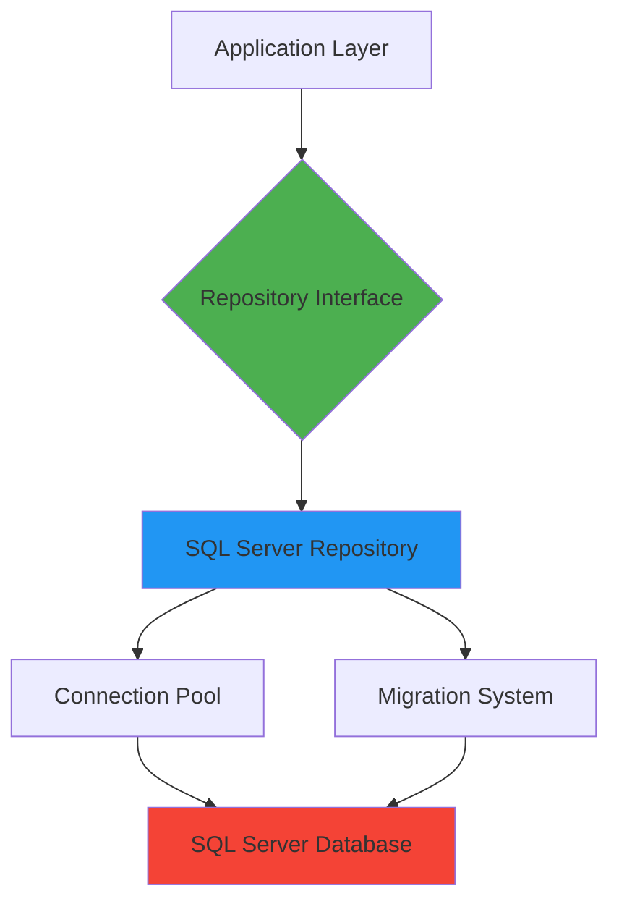
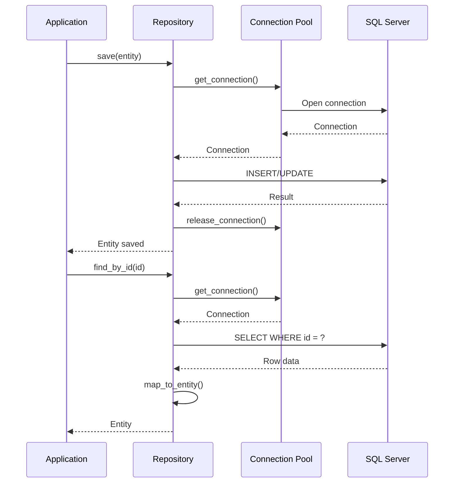
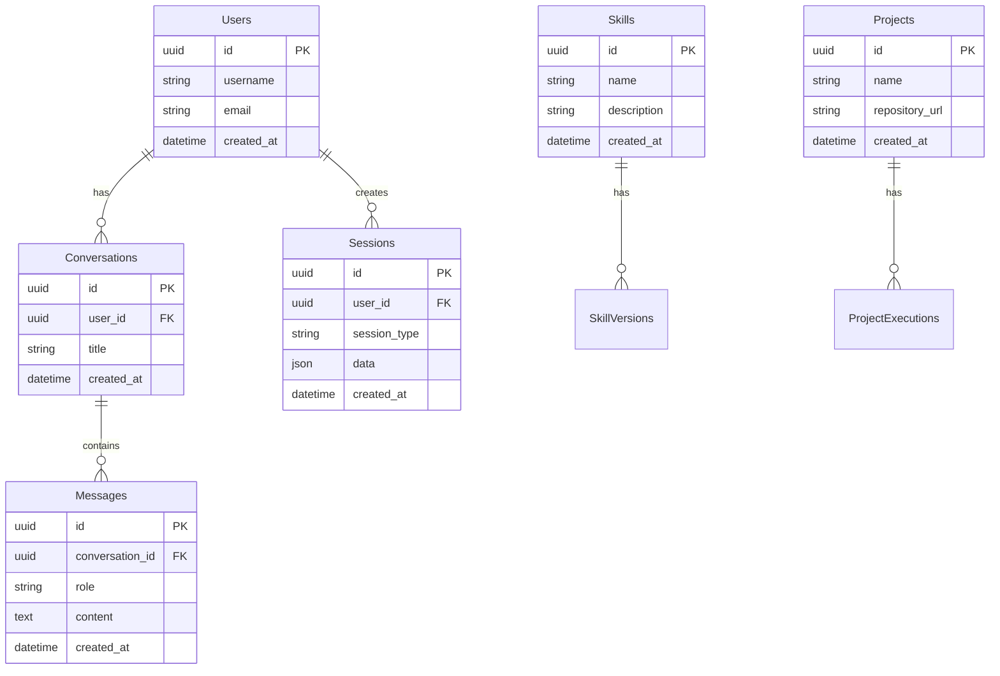

# Integração SQL Server - Persistência de Dados

**Status**: 📝 Planejado  
**Prioridade**: 🔴 Alta  
**Última atualização**: 2026-01-20

## Visão Geral

O SQL Server é usado como banco de dados relacional principal para persistência de dados no Jarvis CLI. Ele armazena informações críticas como usuários, conversas, sessões, skills e projetos, permitindo que os dados sobrevivam a reinicializações e sejam compartilhados entre múltiplas instâncias.

O SQL Server é usado para:
- **User Management**: Armazenamento de usuários e autenticação
- **Conversation History**: Histórico de conversas e mensagens
- **Session Persistence**: Persistência de sessões de agentes
- **Skills Storage**: Armazenamento de skills e suas versões
- **Project Data**: Dados de projetos e execuções

## Motivação

### Por que SQL Server?

1. **Robustez**: Banco de dados enterprise-grade com ACID garantido
2. **Relacional**: Modelagem relacional para dados estruturados
3. **Transações**: Suporte completo a transações e consistência
4. **Performance**: Otimizado para queries complexas e grandes volumes
5. **Ecosystem**: Integração com ferramentas Microsoft e .NET

### Alternativas Consideradas

| Banco | Vantagens | Desvantagens |
|-------|-----------|--------------|
| **SQL Server** | Enterprise features, transações robustas | Requer licença para produção |
| **PostgreSQL** | Open source, muito similar | Não é padrão no ecossistema .NET |
| **SQLite** | Zero configuração, embedded | Limitado para múltiplas instâncias |
| **MySQL** | Open source, popular | Menos features enterprise |

## Arquitetura

### Repository Pattern



### Data Flow



### Schema Overview



## Especificação Técnica

### Database Connection

```rust
use tiberius::{Client, Config};
use tokio_util::compat::TokioAsyncWriteCompatExt;
use std::time::Duration;

pub struct Database {
    config: Config,
}

impl Database {
    pub async fn new(connection_string: &str) -> Result<Self> {
        let config = Config::from_connection_string(connection_string)?;
        Ok(Self { config })
    }
    
    pub async fn get_client(&self) -> Result<Client<tokio::net::TcpStream>> {
        let tcp = tokio::net::TcpStream::connect(self.config.get_addr()).await?;
        tcp.set_nodelay(true)?;
        
        let client = Client::connect(self.config.clone(), tcp.compat_write()).await?;
        Ok(client)
    }
    
    pub async fn migrate(&self) -> Result<()> {
        // Executar migrations usando sqlx ou sistema customizado
        // Por enquanto, migrations são executadas manualmente ou via scripts
        Ok(())
    }
}
```

### Repository Trait

```rust
use async_trait::async_trait;
use uuid::Uuid;

#[async_trait]
pub trait Repository<T, ID> {
    async fn find_by_id(&self, id: ID) -> Result<Option<T>>;
    async fn find_all(&self) -> Result<Vec<T>>;
    async fn save(&self, entity: &T) -> Result<T>;
    async fn update(&self, entity: &T) -> Result<T>;
    async fn delete(&self, id: ID) -> Result<()>;
}
```

### User Repository Implementation

```rust
use sqlx::{FromRow, Row};
use uuid::Uuid;
use chrono::{DateTime, Utc};

#[derive(Debug, Clone, FromRow)]
pub struct User {
    pub id: Uuid,
    pub username: String,
    pub email: String,
    pub password_hash: String,
    pub created_at: DateTime<Utc>,
    pub updated_at: DateTime<Utc>,
}

pub struct UserRepository {
    db: Database,
}

impl UserRepository {
    pub fn new(db: Database) -> Self {
        Self { db }
    }
}

#[async_trait]
impl Repository<User, Uuid> for UserRepository {
    async fn find_by_id(&self, id: Uuid) -> Result<Option<User>> {
        let mut client = self.db.get_client().await?;
        
        let mut stream = client
            .query(
                "SELECT id, username, email, password_hash, created_at, updated_at 
                 FROM users WHERE id = @P1",
                &[&id],
            )
            .await?;
        
        if let Some(row) = stream.into_row().await? {
            let user = User::from_row(&row)?;
            Ok(Some(user))
        } else {
            Ok(None)
        }
    }
    
    async fn find_all(&self) -> Result<Vec<User>> {
        let mut client = self.db.get_client().await?;
        
        let mut stream = client
            .query(
                "SELECT id, username, email, password_hash, created_at, updated_at 
                 FROM users ORDER BY created_at DESC",
                &[],
            )
            .await?;
        
        let mut users = Vec::new();
        while let Some(row) = stream.into_row().await? {
            users.push(User::from_row(&row)?);
        }
        
        Ok(users)
    }
    
    async fn save(&self, user: &User) -> Result<User> {
        let mut client = self.db.get_client().await?;
        
        client.execute(
            "INSERT INTO users (id, username, email, password_hash, created_at, updated_at)
             VALUES (@P1, @P2, @P3, @P4, @P5, @P6)",
            &[&user.id, &user.username, &user.email, &user.password_hash, 
              &user.created_at, &user.updated_at],
        ).await?;
        
        Ok(user.clone())
    }
    
    async fn update(&self, user: &User) -> Result<User> {
        let mut client = self.db.get_client().await?;
        
        client.execute(
            "UPDATE users 
             SET username = @P2, email = @P3, password_hash = @P4, updated_at = @P5
             WHERE id = @P1",
            &[&user.id, &user.username, &user.email, &user.password_hash, &Utc::now()],
        ).await?;
        
        Ok(user.clone())
    }
    
    async fn delete(&self, id: Uuid) -> Result<()> {
        let mut client = self.db.get_client().await?;
        
        client.execute("DELETE FROM users WHERE id = @P1", &[&id]).await?;
        
        Ok(())
    }
}
```

### Conversation Repository

```rust
#[derive(Debug, Clone, FromRow)]
pub struct Conversation {
    pub id: Uuid,
    pub user_id: Uuid,
    pub title: String,
    pub created_at: DateTime<Utc>,
    pub updated_at: DateTime<Utc>,
}

#[derive(Debug, Clone, FromRow)]
pub struct Message {
    pub id: Uuid,
    pub conversation_id: Uuid,
    pub role: String,
    pub content: String,
    pub created_at: DateTime<Utc>,
}

pub struct ConversationRepository {
    db: Database,
}

impl ConversationRepository {
    pub async fn find_with_messages(
        &self,
        conversation_id: Uuid,
    ) -> Result<Option<(Conversation, Vec<Message>)>> {
        let conversation = self.find_by_id(conversation_id).await?;
        
        if let Some(conv) = conversation {
            let mut client = self.db.get_client().await?;
            
            let mut stream = client
                .query(
                    "SELECT id, conversation_id, role, content, created_at
                     FROM messages 
                     WHERE conversation_id = @P1
                     ORDER BY created_at ASC",
                    &[&conversation_id],
                )
                .await?;
            
            let mut messages = Vec::new();
            while let Some(row) = stream.into_row().await? {
                messages.push(Message::from_row(&row)?);
            }
            
            Ok(Some((conv, messages)))
        } else {
            Ok(None)
        }
    }
    
    pub async fn find_by_user(
        &self,
        user_id: Uuid,
        limit: Option<i64>,
    ) -> Result<Vec<Conversation>> {
        let mut client = self.db.get_client().await?;
        
        let query = if let Some(limit) = limit {
            format!(
                "SELECT TOP {} id, user_id, title, created_at, updated_at
                 FROM conversations 
                 WHERE user_id = @P1
                 ORDER BY updated_at DESC",
                limit
            )
        } else {
            "SELECT id, user_id, title, created_at, updated_at
             FROM conversations 
             WHERE user_id = @P1
             ORDER BY updated_at DESC".to_string()
        };
        
        let mut stream = client.query(&query, &[&user_id]).await?;
        
        let mut conversations = Vec::new();
        while let Some(row) = stream.into_row().await? {
            conversations.push(Conversation::from_row(&row)?);
        }
        
        Ok(conversations)
    }
}
```

### Migration System

```rust
// migrations/001_create_users.sql
CREATE TABLE IF NOT EXISTS users (
    id UUID PRIMARY KEY,
    username VARCHAR(255) NOT NULL UNIQUE,
    email VARCHAR(255) NOT NULL UNIQUE,
    password_hash VARCHAR(255) NOT NULL,
    created_at TIMESTAMP NOT NULL DEFAULT CURRENT_TIMESTAMP,
    updated_at TIMESTAMP NOT NULL DEFAULT CURRENT_TIMESTAMP
);

CREATE INDEX idx_users_email ON users(email);
CREATE INDEX idx_users_username ON users(username);

// migrations/002_create_conversations.sql
CREATE TABLE IF NOT EXISTS conversations (
    id UUID PRIMARY KEY,
    user_id UUID NOT NULL REFERENCES users(id) ON DELETE CASCADE,
    title VARCHAR(500),
    created_at TIMESTAMP NOT NULL DEFAULT CURRENT_TIMESTAMP,
    updated_at TIMESTAMP NOT NULL DEFAULT CURRENT_TIMESTAMP
);

CREATE INDEX idx_conversations_user_id ON conversations(user_id);

// migrations/003_create_messages.sql
CREATE TABLE IF NOT EXISTS messages (
    id UUID PRIMARY KEY,
    conversation_id UUID NOT NULL REFERENCES conversations(id) ON DELETE CASCADE,
    role VARCHAR(50) NOT NULL,
    content TEXT NOT NULL,
    created_at TIMESTAMP NOT NULL DEFAULT CURRENT_TIMESTAMP
);

CREATE INDEX idx_messages_conversation_id ON messages(conversation_id);
```

## Configuração

### config.toml

```toml
[sqlserver]
# Connection string do SQL Server
connection_string = "Server=localhost,1433;Database=jarvis;User Id=sa;Password=YourPassword123!;TrustServerCertificate=True;MultipleActiveResultSets=true"

# Habilitar SQL Server (se false, usa storage local)
enabled = true

# Configurações de pool de conexões
[sqlserver.pool]
# Máximo de conexões no pool
max_connections = 10

# Timeout para adquirir conexão (segundos)
acquire_timeout_seconds = 5

# Timeout de idle (segundos)
idle_timeout_seconds = 600

# Tempo máximo de vida da conexão (segundos)
max_lifetime_seconds = 1800

# Configurações de migração
[sqlserver.migration]
# Executar migrations automaticamente na inicialização
auto_migrate = true

# Diretório de migrations
migrations_dir = "./migrations"

# Configurações de transação
[sqlserver.transaction]
# Timeout padrão de transação (segundos)
default_timeout_seconds = 30

# Isolation level (ReadCommitted, ReadUncommitted, RepeatableRead, Serializable)
isolation_level = "ReadCommitted"
```

### Variáveis de Ambiente

```bash
# SQL Server connection
SQLSERVER_CONNECTION_STRING=Server=localhost,1433;Database=jarvis;User Id=sa;Password=...
SQLSERVER_ENABLED=true

# Connection pool
SQLSERVER_MAX_CONNECTIONS=10
SQLSERVER_ACQUIRE_TIMEOUT_SECONDS=5
```

## Exemplos de Uso

### Exemplo 1: Inicialização com Migrations

```rust
use jarvis_core::database::Database;
use jarvis_core::config::Config;

async fn initialize_database(config: &Config) -> Result<Database> {
    let db = Database::new(&config.sqlserver.connection_string).await?;
    
    if config.sqlserver.migration.auto_migrate {
        db.migrate().await?;
    }
    
    Ok(db)
}
```

### Exemplo 2: User Management

```rust
use jarvis_core::repositories::UserRepository;
use uuid::Uuid;

async fn create_user(
    repo: &UserRepository,
    username: &str,
    email: &str,
    password: &str,
) -> Result<User> {
    use bcrypt::{hash, DEFAULT_COST};
    
    let password_hash = hash(password, DEFAULT_COST)?;
    
    let user = User {
        id: Uuid::new_v4(),
        username: username.to_string(),
        email: email.to_string(),
        password_hash,
        created_at: Utc::now(),
        updated_at: Utc::now(),
    };
    
    repo.save(&user).await
}

async fn authenticate_user(
    repo: &UserRepository,
    email: &str,
    password: &str,
) -> Result<Option<User>> {
    use bcrypt::verify;
    
    let user = repo.find_by_email(email).await?;
    
    if let Some(user) = user {
        if verify(password, &user.password_hash)? {
            return Ok(Some(user));
        }
    }
    
    Ok(None)
}
```

### Exemplo 3: Conversation Management

```rust
use jarvis_core::repositories::ConversationRepository;

async fn create_conversation(
    repo: &ConversationRepository,
    user_id: Uuid,
    title: &str,
) -> Result<Conversation> {
    let conversation = Conversation {
        id: Uuid::new_v4(),
        user_id,
        title: title.to_string(),
        created_at: Utc::now(),
        updated_at: Utc::now(),
    };
    
    repo.save(&conversation).await
}

async fn add_message(
    repo: &ConversationRepository,
    conversation_id: Uuid,
    role: &str,
    content: &str,
) -> Result<Message> {
    let message = Message {
        id: Uuid::new_v4(),
        conversation_id,
        role: role.to_string(),
        content: content.to_string(),
        created_at: Utc::now(),
    };
    
    repo.save_message(&message).await
}
```

### Exemplo 4: Transactions

```rust
use sqlx::Transaction;

async fn transfer_conversation(
    db: &Database,
    from_user_id: Uuid,
    to_user_id: Uuid,
    conversation_id: Uuid,
) -> Result<()> {
    let mut client = db.get_client().await?;
    
    // Iniciar transação
    client.execute("BEGIN TRANSACTION", &[]).await?;
    
    // Verificar que a conversa pertence ao usuário origem
    let mut stream = client
        .query(
            "SELECT * FROM conversations WHERE id = @P1 AND user_id = @P2",
            &[&conversation_id, &from_user_id],
        )
        .await?;
    
    if stream.into_row().await?.is_none() {
        client.execute("ROLLBACK", &[]).await?;
        return Err(anyhow::anyhow!("Conversation not found or access denied"));
    }
    
    // Transferir conversa
    client
        .execute(
            "UPDATE conversations SET user_id = @P1 WHERE id = @P2",
            &[&to_user_id, &conversation_id],
        )
        .await?;
    
    // Commit transação
    client.execute("COMMIT", &[]).await?;
    Ok(())
}
```

## Considerações de Implementação

### Dependências

**Crates Rust necessários:**

```toml
[dependencies]
# SQL Server client (via tiberius)
tiberius = { version = "0.12", features = ["tokio", "rustls"] }
tokio-util = { version = "0.7", features = ["compat"] }

# SQL toolkit (alternativa - sqlx não tem suporte oficial para SQL Server ainda)
# sqlx = { version = "0.7", features = ["runtime-tokio-rustls", "migrate", "uuid", "chrono"] }

# Async runtime
tokio = { version = "1", features = ["full"] }
async-trait = "0.1"

# Serialização
serde = { version = "1", features = ["derive"] }
serde_json = "1"

# Error handling
anyhow = "1"
thiserror = "1"

# Utilities
uuid = { version = "1", features = ["v4", "serde"] }
chrono = { version = "0.4", features = ["serde"] }
bcrypt = "0.15"  # Para hash de senhas
```

### Desafios Técnicos

1. **Connection Pooling**
   - **Desafio**: Gerenciar pool de conexões eficientemente
   - **Solução**: Usar `sqlx::Pool` ou `tiberius::Client` com pooling
   - **Otimização**: Configurar tamanho do pool baseado em carga

2. **Migrations**
   - **Desafio**: Gerenciar schema changes ao longo do tempo
   - **Solução**: Usar sistema de migrations do sqlx ou Flyway
   - **Versionamento**: Manter histórico de migrations

3. **Type Mapping**
   - **Desafio**: Mapear tipos SQL Server para Rust
   - **Solução**: Usar `FromRow` derive do sqlx
   - **Custom Types**: Implementar conversões customizadas quando necessário

4. **Error Handling**
   - **Desafio**: SQL Server pode estar temporariamente indisponível
   - **Solução**: Implementar retry logic e health checks
   - **Resilience**: Fallback para storage local quando DB indisponível

### Performance

- **Connection Pooling**: Reutilizar conexões através de pool
- **Prepared Statements**: Usar prepared statements para queries repetidas
- **Indexes**: Criar índices apropriados para queries frequentes
- **Query Optimization**: Analisar e otimizar queries lentas

### Segurança

- **SQL Injection**: Sempre usar parameterized queries
- **Connection String**: Não expor connection strings em logs
- **Encryption**: Usar conexões encriptadas (TLS)
- **Access Control**: Implementar row-level security quando necessário

### Troubleshooting

**Problema**: Não consegue conectar ao SQL Server
- Verificar se serviço está rodando
- Verificar connection string
- Verificar firewall e portas (1433)
- Verificar credenciais

**Problema**: Migrations falham
- Verificar se migrations estão no diretório correto
- Verificar permissões do usuário do banco
- Verificar se há migrations conflitantes
- Verificar logs de erro detalhados

**Problema**: Queries lentas
- Analisar execution plans
- Verificar índices existentes
- Otimizar queries complexas
- Considerar denormalização para casos específicos

## Roadmap de Implementação

### Fase 1: Core Integration (Sprint 1)

- [ ] Adicionar dependência `sqlx` ou `tiberius`
- [ ] Implementar `Database` struct
- [ ] Criar sistema de migrations
- [ ] Implementar trait `Repository`
- [ ] Adicionar configuração ao `config.toml`

### Fase 2: Basic Repositories (Sprint 2)

- [ ] Implementar `UserRepository`
- [ ] Implementar `ConversationRepository`
- [ ] Implementar `MessageRepository`
- [ ] Adicionar testes de integração

### Fase 3: Advanced Features (Sprint 3)

- [ ] Implementar transações
- [ ] Adicionar suporte a queries complexas
- [ ] Implementar paginação
- [ ] Adicionar métricas e logging

### Fase 4: Production Ready (Sprint 4)

- [ ] Otimizar performance
- [ ] Adicionar connection pooling avançado
- [ ] Implementar backup/restore
- [ ] Documentação de deployment

## Referências

### Código Base (.NET)

- `Jarvis.Infrastructure/DependencyInjection/InfrastructureInjection.cs` (linhas 132-183) - Configuração DbContext
- `Jarvis.Infrastructure/Data/Context/JarvisDbContext.cs` - DbContext SQL Server
- `Jarvis.Infrastructure/Data/Repositories/` - Implementações de repositories

### Documentação Externa

- [SQL Server Documentation](https://docs.microsoft.com/sql/)
- [SQLx Documentation](https://docs.rs/sqlx/)
- [Tiberius Documentation](https://docs.rs/tiberius/)
- [Database Design Best Practices](https://www.sqlshack.com/sql-server-database-design-best-practices/)

### Recursos Adicionais

- [SQL Server Docker Image](https://hub.docker.com/_/microsoft-mssql-server) - Para desenvolvimento local
- [SQL Server Express](https://www.microsoft.com/sql-server/sql-server-downloads) - Versão gratuita
- [SQL Server Management Studio](https://docs.microsoft.com/sql/ssms/) - Ferramenta de gerenciamento

---

**Status**: 📝 Planejado  
**Prioridade**: 🔴 Alta  
**Última atualização**: 2026-01-20
